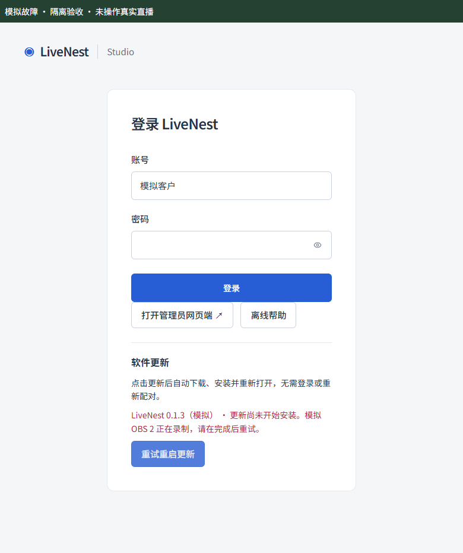
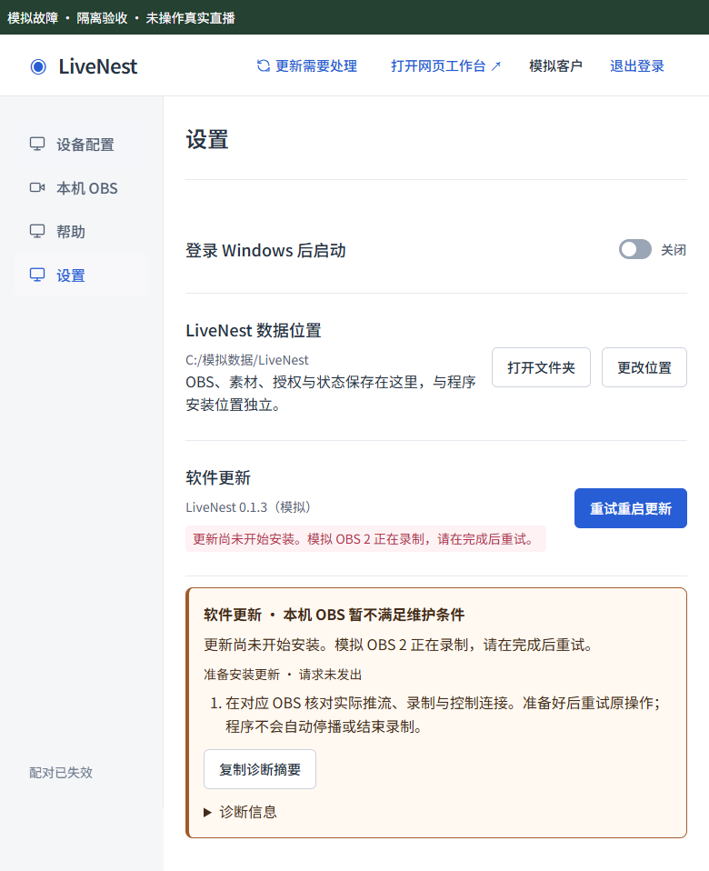

<!-- 文件用途：记录 0.1.4 更新阻塞修复、同类审计、回归证据与真实验收边界。 -->
# LiveNest 0.1.4：重启更新恢复

**后续真实设备发现**：本版安装包在安装器插件工作目录中触发 PowerShell `Add-Type` 的同名 `System.dll` 引用冲突，出现空白报错并停止安装。此前回下载/解包检查不能证明安装成功；请使用 [0.1.5 修复版](0.1.5发布.md)。

## 问题与处理

0.1.1–0.1.3 将重启更新绑定到云端维护许可，配对失效时不能取得许可；0.1.3 的账号和设备权限校验又会提前阻止更新入口。准备失败后界面仍显示下载完成，没有准确重试原阶段。本版将本机程序更新与云端配置授权分开。

| 编号 | 同类审计结论 | 处理与证据 |
| --- | --- | --- |
| U01 | 配对失效、登录过期或云端不可用阻止更新 | 本地可信 IPC 仅允许检查、下载、安装及组合更新；最小 DTO 仅含版本、忙碌和更新状态。登录页、标题栏及设置共用入口。真实 Electron 未登录 IPC 验收通过。 |
| U02 | 未选择数据位置也无法安装更新 | 允许首次使用时更新；Manager 回归覆盖空目录和已有失效配对，原维护凭据不改写。 |
| U03 | 准备失败仍显示绿色下载完成，重试变成无效检查 | preparing/error/install 阶段与原动作重试；失败保留已知版本，错误不记作成功。 |
| U04 | 安装器失败前已放行应用退出 | 仅在更新器 before-quit-for-update 事件放行；异常、错误事件或交接超时保留客户端，并显示启动安装失败。 |
| U05 | 重复点击或旧通知覆盖当前准备结果 | 宿主串行锁、安装锁、界面请求序号；晚到下载事件与旧配置快照不会覆盖安装错误。 |
| U06 | 维护连接失败退化成通用错误，配对原因被掩盖 | 无会话 RPC 返回 AGENT_CONNECTION，非法操作返回 AGENT_REQUEST；ready 与退出错误保留 AGENT_AUTH 等原因码。 |
| U07 | Agent 排空后新开播或保存失败 | 排空前后两次只读检查全部注册、候选和归档 OBS；保存失败阻止安装。失败后仅恢复原本运行的 Agent；排空超时不启动重复进程。 |
| U08 | 普通退出是否仍被云端维护阻止 | main 已修复，保留并回归取消、忙碌、并发、离线排空失败行为；不强杀 Agent/OBS。 |
| U09 | 配置维护的待确认凭据是否能直接清除 | 不能清除：请求可能已到云端，凭据用于幂等恢复。本版更新不新建维护锁，也不清除原配对/维护/待同步身份。 |

## 客户使用

- 新版登录页和设置中点击“更新并重启”，自动完成下载、检查、静默安装与重新打开；已有下载缓存时点击“重启更新”。无需重复确认、手动找安装包或先解决配对问题。
- 点击更新后，先检查本机 OBS、排空已接收任务、确认 Agent 退出，再复查 OBS 和配置落盘。推流、录制、状态未知或任务未结束会给出具体阻塞提示；程序不会自动结束直播。
- 安装准备失败显示“更新尚未开始安装”及原因，按钮为“重试重启更新”；下载、校验和安装错误区分处理。
- **旧版卡住时**：等待现有任务结束，通过托盘正常退出 LiveNest，从[官方发行页](https://github.com/Doris619619/LiveNest-Releases/releases/latest)下载新版覆盖安装，保留原数据目录。不要强杀、卸载或删除身份文件。旧版本自身的更新逻辑无法靠下载新包修正。
- 网站下载版本同步为 0.1.4；必须先发布并验证安装资产，再部署下载页，避免出现空链接。

## 验证

2026-09-23 本地完整 `npm run verify` 通过：50 个测试文件、347 项回归、8 项部署测试、类型检查、lint、网页及 Agent 构建。下载页版本和升级帮助随后补充，重新构建相关产物；PR CI 会复查最终提交。

- `desktop-updates.test.ts`：无需重复确认、准备失败、原阶段重试、重复点击、迟到事件、安装异常/错误事件/超时、下载网络/空间/校验错误与脱敏。
- `desktop-local-update.test.ts`、`desktop-update-manager.test.ts`：本机检查与排空顺序、开播竞态、排空超时、保存失败、连接恢复失败、未登录 DTO 白名单、原维护状态保留。
- `desktop-agent-host.test.ts`、`desktop-shutdown.test.ts`：真实原因分类及现有退出保护。
- `npm run desktop:build`：NSIS 构建和包后检查通过，核对 ASAR 隔离、离线资源、内置 Node 和 Electron fuses。
- `node scripts/desktop/update-acceptance.mjs`：真实 Electron 使用独立临时 userData，验证未登录更新、未选择数据位置、非更新操作拒绝、最小 DTO、Renderer Node 隔离及 780px 窗口；浏览器合成桥接验证录制阻塞、一键更新与正确重试、失效配对、旧状态隔离和 Escape 焦点恢复。

下图均为**模拟故障**，不是实际直播或真实安装升级证据。

## 发布与边界

只有最终 PR 的 Windows、Ubuntu 和部署脚本检查通过后才合并；从合并后的 main 创建新 `v0.1.4` 标签，公开安装器、blockmap 和 latest.yml 必须来自同一 CI 构建并回下载核对。发布、公共文件哈希和网站部署结果记录到该 PR，不能将本地构建称为已发布。

无数据迁移、身份重建、协议变更或新增依赖。客户端兼容现有云端；网站部署只需同步下载入口和公开资产。真实 OAuth、生产开播、用户数据迁移和真实 0.1.1 → 0.1.4 覆盖升级未作为自动测试。更新器交接事件代表进入安装退出流程，不代表用户完成安装向导；UAC、Windows 安装交互及安装后首次启动仍需真实设备验收。未配置 Authenticode 证书，不能将构建日志中的 signing 当作可信签名。
