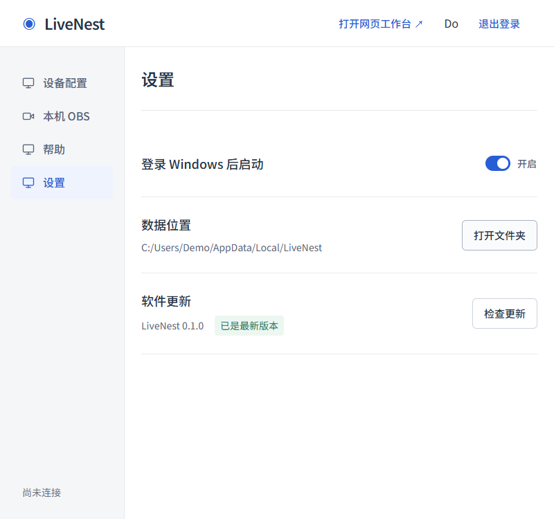

<!-- 文件用途：记录 OBS 准备超时的实际根因、反馈修复及发布边界。 -->
# OBS 准备超时与步骤反馈修复

## 状态与实际故障

2026-09-19，用户在公开 0.1.0 的“准备 OBS”等待一分钟后收到 WebSocket 超时。失败说明位于页面顶部，滚动到步骤时只能看到“需要处理”。

本机只读诊断发现，两份前期验收 OBS 的真实进程镜像位于 Codex MSIX 缓存目录，Windows CIM 却报告普通 AppData 逻辑路径。当前用户从普通桌面启动的 LiveNest 误认为自己的 OBS 已运行，转而等待另一个端口。把两侧逻辑路径都交给当前进程的 `realpath` 仍不足以区分跨虚拟化上下文的文件。

核对专用目录归属并通过对应 WebSocket 确认两份测试 OBS 都未推流、未录制后，已关闭这两个遗留测试进程；没有删除实例配置。用户重试后明确确认“已成功配置 OBS”。这是当前故障恢复的真实结果，不代表下面的代码已经装进用户正在使用的 0.1.0。

## 修复内容

- 通过目标文件句柄取得 NT 路径，再与进程内核镜像路径比较；不同物理安装不会因逻辑路径相同而互相认领。重复进程和其他程序占用端口仍拒绝启动。
- 配置页及“本机 OBS”显示目录准备、解压、配置写入、启动和端口检查、场景检查、云端同步等实际阶段及整个操作用时，不生成模拟百分比。
- 错误保留在失败步骤旁，提供重新检查与离线图解；重新检查复用现有实例。后台状态可跨侧栏切换、退出登录再登录读取，表单在同一登录会话内保留。
- WebSocket 等待超时保留最后一次安全诊断；解压失败分别提示超时、目录权限、空间及安装包检查。

- 设置页按网页风格改成横向设置行，统一 18px 标题和分隔线；自动启动复用网站开关，数据路径与打开目录按钮对齐，版本与更新状态并列，窄窗口自然换行。已有配置不再显示无效的目录更改按钮。

## 验证

- `npm.cmd run verify`：类型、ESLint、147 项测试、8 项部署测试、网页构建及 Agent 构建通过。
- Windows 原生测试用两份专用临时 Node 程序模拟进程：区分不同 exe、识别目录 junction 和 Windows 短路径启动、拒绝同 exe 重复进程。测试不控制真实 OBS，结束清理自己的进程与临时目录。
- `npm.cmd run desktop:renderer`、`npm.cmd run desktop:compile`：静态桌面页面和宿主构建通过。
- `node scripts/desktop/feedback-acceptance.mjs`：Edge 无头浏览器、示例桥接状态；阶段和计时、按钮禁用、切页、表单保留、就地错误、重新登录恢复、800px 无横向溢出、重试与完成通过。
- 原用户安装版：清理已确认空闲的测试进程后，用户重试成功。
- 未执行：新修复安装包的干净 Windows 验收、跨 MSIX/普通桌面的新二进制安装验收、实际频道授权和直播音画验收。本次不替换用户客户端，不更新云端，不发布安装器。

Windows CI 首轮发现原生镜像路径比较遗漏短路径形式；补充通过物理设备路径打开镜像文件并按句柄规范化，同时加入短路径启动回归。相关 API 约定见 [GetFinalPathNameByHandle](https://learn.microsoft.com/en-us/windows/win32/api/fileapi/nf-fileapi-getfinalpathnamebyhandlew)。

## 示例截图

截图来自浏览器模拟状态，端口与错误为测试数据，不是新的实际安装验收。

## 设置页示例

同样来自示例桥接状态，打开文件夹和更新均未触发真实系统操作。

