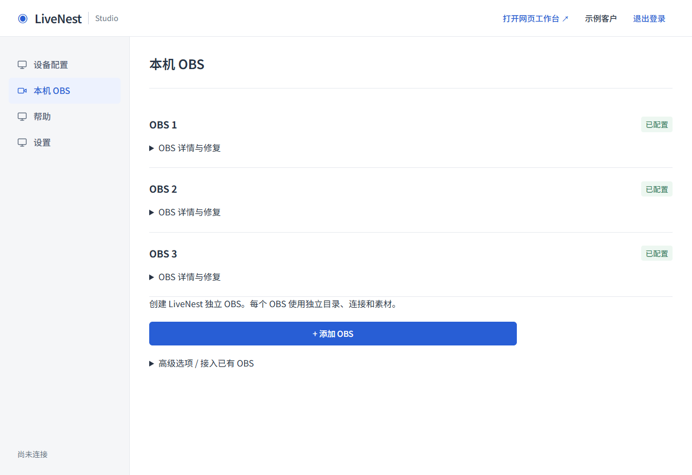
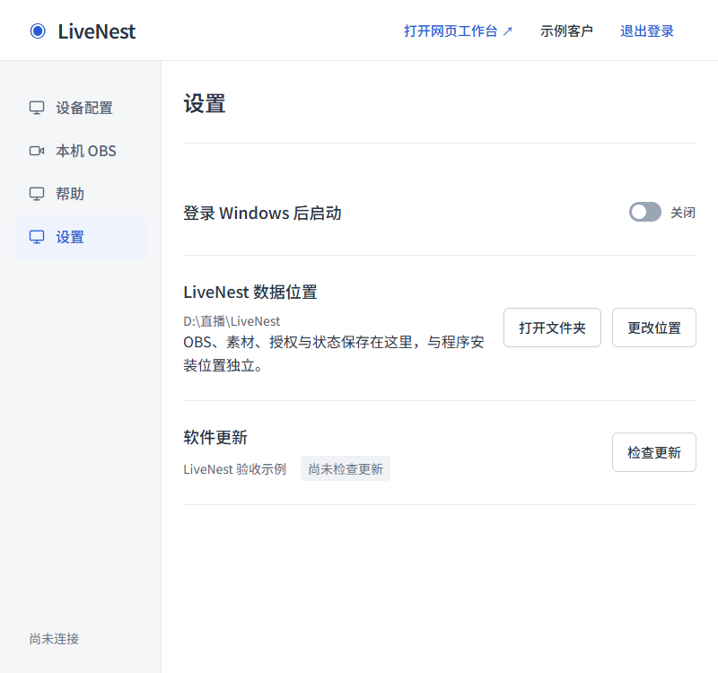

<!-- 文件用途：记录 main 差异、实现文件、运行目录、执行链和本次验证边界。 -->
# LiveNest 本地数据与独立 OBS

基准：远端 main `8993d84`。实现分支：`feat/20260923-data-obs`。实现阶段完成本地验收；合并前继续执行当前 PR 的代码审查及 Windows／Linux CI。本次不含云端部署或公开发布。

## 与 main 的差异

| 主题 | 原有能力 | 本次完成 |
| --- | --- | --- |
| 安装资源 | Node、Agent、干净 OBS ZIP 位于 resources | 保持唯一模板和白名单打包 |
| 位置选择 | 安装位置可选，数据自动优先 D 盘 | 安装向导分别选择两项，未选择数据位置不能创建 OBS |
| 根归属 | 只有 OBS 子目录 owner | 根标记、真实路径／链接／包含关系校验，未知非空目录拒绝 |
| 加密配置 | AppData settings.json | state/desktop/settings.json；先读回验证再提交位置，旧密文保留 |
| 创建实例 | add 可能复用旧 candidate | add 创建、prepare 指定重试、restore-candidate 显式恢复归档 |
| 迁移 | 复制和 exe 重定位 | 文件清单／大小／SHA-256 校验，托管场景素材路径修正，所有候选进程保护 |
| UI | 来源选择并列 | 实例列表与添加主按钮，高级来源折叠，恢复能力直接保留 |
| 配对 | maintenance、candidate、inventoryPending | 保留云端协议和 main 要求，新增无需重新配对 |

## 代码与文件

- 安装：`scripts/desktop/installer.nsh`、`data-location.ps1`。数据页、UTF-16 路径返回、安装前再次校验、静默升级沿用，静默新装拒绝猜位置。
- 数据：`electron/data-root.ts`、`data-location.ts`、`settings.ts`。根标记、空／已有数据判别、配置兼容、迁移校验和路径重定位。
- 协调：`electron/manager.ts`、`obs-setup.ts`、`main.ts`、`diagnostics.ts`、`src/shared/desktop.ts`。独立创建、归档恢复、受限 IPC、目标候选反馈和安全检查。
- UI：`desktop/app/page.tsx`、`obs-picker.tsx`、`settings-panel.tsx`。默认创建与高级兼容分层。
- 测试：数据根／迁移／安装器新测试，candidate 和 OBS 文件回归，以及三 OBS 和静态 UI 验收脚本。原有真实 Electron 验收入口同步采用 add 创建。
- 文档：README、桌面配置与网页协作、桌面安装与发布、验证记录、本文件。工程协作规范同步用户指定的 Threadline 规范，明确禁止 codex 分支前缀，并保留 PR #4 要求。

## 目录与事务

```text
安装目录/
  LiveNest.exe
  resources/app.asar
  resources/agent/
  resources/vendor/node.exe
  resources/vendor/obs.zip

选择的父目录/LiveNest/
  .livenest-root.json
  obs/main/
  obs/obs_<随机ID>/
  media/<instanceId>/videos/
  media/<instanceId>/music/
  media/<instanceId>/.uploads/
  state/desktop/settings.json
  state/instances/<instanceId>/
  state/                         # main 及现有业务状态、令牌和审计
  logs/
  temp/                          # 按需
```

OBS 自身日志保留在对应 portable OBS 内，仍位于根目录下。AppData 的定位 JSON 不含凭据；旧版密文保留作为兼容备份，Electron 可再生缓存仍由系统管理。当前 Windows 用户以 DPAPI 解密；迁移不改变频道密钥、电脑身份或实例 ID。

根目录标记是产品归属保护，不替代 Windows 文件权限。未知目录不接管；旧无标记目录必须由原可解密配置指向、符合已知结构且托管 owner 匹配。数据盘失联、密文损坏或 root ID 不符时失败关闭，启动时以原生错误对话框提示恢复原盘或账户，绝不生成替代身份。旧版已保存但尚未解压的候选可继续迁入；目录已有无归属文件时仍拒绝接管。

迁移先预检目标、检查所有 OBS 已关闭、获取既有维护许可并停止 Agent，再完整复制和两侧校验。只修改已识别的 OBS 场景本地路径字段和托管 exe；不替换任意字符串，不修改外部 OBS。手动 OBS 仍引用旧根时阻止切换。

目标 `.livenest-migration.json` 记录 copying、verified、ready-to-switch、switched 或 failed 阶段及校验清单，不记录密钥。位置提交前失败恢复旧 Agent；提交后恢复失败保留新位置与维护锁。旧目录和失败目标始终保留；失败目标不自动覆盖续写，重试选择另一个空目标。原定位记录是重启后的权威入口，不会因旧备份存在而倒退。

## 两条执行链

**第一次：**安装选择程序目录和数据父目录 → 首次运行验证根并保存加密配置 → 准备第一个 OBS → 持久化 main candidate、独立密码与空闲端口 → 创建素材目录 → 干净 ZIP 解压 → portable 和默认参数 → `--portable --multi` 启动 → 真实进程与端口归属检查 → WebSocket 认证 → LIVE、VIDEO、MUSIC 创建／验证 → 保存正式实例 → 原配对流程。

**第二次及以后：**添加 OBS → 所有相关实例空闲检查／云端维护 → 分配未占用 ID、目录、端口和密码 → 保存新 candidate → 从同一干净 ZIP 初始化与验证 → 追加正式实例 → inventory RPC → 等待旧会话退出 → 新 Agent 心跳确认 → 释放维护。任何创建链路都不包含 `StartStream`。

**首个失败：**继续准备 main；若已撤销，从归档区域恢复。main 成功前不增加其他实例。后续 add 不复用旧失败候选；重试按 activity.instanceId 定位，不依赖列表第一项。

**保留兼容：**扫描及取消、复制已有程序、手动专用 OBS 接入、连接修复、候选撤销／归档恢复、旧 main 状态布局、现有配对协议、maintenance 与 inventoryPending 恢复，以及当前音视频默认参数。

## 验证

- `npm.cmd run verify`：291 项业务测试、8 项部署测试、类型检查、Lint、网页生产构建、Agent 构建通过。测试包含安装脚本在真实 Windows PowerShell 的隔离路径调用。
- 数据测试覆盖中文／空格、未知非空目录、损坏标记、安装包含关系、junction、加密写失败、定位提交失败、旧配置保留、数据盘消失、复制校验失败、外部素材引用和候选／归档路径迁移。
- Manager 测试覆盖运行中归档 OBS 阻止迁移、目标冲突前置拒绝、复制／提交失败恢复旧位置、已切换后 Agent 恢复失败保留维护状态。
- `desktop:renderer` 和静态 UI 验收通过：首次创建、连续新增、高级折叠、目标候选重试、设置按钮、800 px 无横向溢出。已有进度／重试／重登录／更新反馈脚本通过；素材与账号为合成状态。
- 真实 Windows OBS 32.2.2：顺序创建 3 个独立实例，端口 15455／15456／15457，分别通过 WebSocket 与标准源验证；OBS 1 自定义场景保持，合成授权文件不变，三个实例均未推流、未录制。最终脚本退出码 0，三个测试进程已清理。[原始结果](evidence/managed-obs-20260923.json)。
- `npm.cmd run desktop:build` 从干净提交 `6a0e555` 完整通过：Renderer、Electron、NSIS、ASAR 隔离、Node 版本、OBS ZIP 摘要、Electron fuse。测试安装包 `LiveNest_0.1.2_x64-setup.exe`，396,883,310 字节，SHA-256 `f5279705627be54e7ce61f607cc2592bbd4f0b83d22063122b92b72dd1e18d60`。[构建证据](evidence/build-20260923.json)。版本沿用 0.1.2，仅为本地验收产物，未发布；这是实现阶段的安装包证据；后续 PR 审查补充了空配置拒绝与 DPAPI 平台边界修复，后续还修复了 CI 暴露的 Windows 短路径兼容，该包不代表最终 PR 代码，也未公开发布。

首次构建曾因 node_modules 联接超出 Turbopack 根目录失败，改为工作区独立依赖后完整 verify 通过；NSIS 卸载器的未引用安装函数警告，以及插件注册之前编译自定义函数的时序和重复包含问题也已修正，完整 NSIS 编译通过。首次真实 OBS 检查成功但隐藏窗口未优雅退出，清理逻辑限定到已确认无输出且路径归属精确匹配的测试 PID 后，完整重跑通过。以上测试清理不改变生产退出／更新策略。





仍待真人验证：干净 Windows 双路径向导、真实安装／覆盖升级／卸载／重装保留；跨盘迁移实际 OBS 素材与授权恢复；已配对生产设备追加 inventory；真实 Google OAuth 与直播音画。单元、合成 UI、本机真实 OBS 检查不替代这些项目。

## 合并前审查补充

发现并修复配置 JSON 为 `null`、空串或 `false` 时被当作不存在的边界。定位记录、根内密文和旧版密文均只有文件真正缺失才允许首次初始化；损坏文件保持原样，不生成替代身份。新增 7 项先失败后通过的回归。

Windows 平台限制下移到实际 DPAPI 边界；生产环境仍拒绝非 Windows 凭据调用，模拟加密的配置事务测试可在 Windows／Linux CI 上一致执行。安装与用户目录语义未改变，README 无额外使用步骤变更。

Windows CI 首轮暴露 `RUNNER~1` 短路径与长路径混用问题：旧候选归属判断和外部素材引用检查必须基于同一真实路径。根、exe 和已识别素材字段现在统一解析真实路径（含不存在叶子的已存在祖先），仍拒绝目录链接。测试期望使用规范路径，并新增 3 项长短路径混用回归。本机以真实 8.3 TEMP 路径执行相关测试，覆盖 Windows runner 环境差异。

## 实际修改文件清单

以下 39 个文件相对审计基准发生变化，含测试与可复核证据。

```text
README.md
desktop/app/obs-picker.tsx
desktop/app/page.tsx
desktop/app/settings-panel.tsx
docs/desktop/evidence/build-20260923.json
docs/desktop/evidence/managed-obs-20260923.json
docs/desktop/screenshots/data-obs/data-location-synthetic.png
docs/desktop/screenshots/data-obs/first-obs-synthetic.png
docs/desktop/screenshots/data-obs/three-obs-narrow-synthetic.png
docs/desktop/screenshots/data-obs/three-obs-synthetic.png
docs/desktop/本地数据与独立OBS.md
docs/desktop/验证记录.md
docs/客户权限与OBS接入.md
docs/工程协作规范.md
docs/桌面安装与发布.md
docs/桌面配置与网页协作.md
electron/data-location.ts
electron/data-root.ts
electron/diagnostics.ts
electron/main.ts
electron/manager.ts
electron/obs-setup.ts
electron/settings.ts
electron/windows-credentials.ts
scripts/desktop/acceptance.mjs
scripts/desktop/data-location.ps1
scripts/desktop/data-obs-ui-acceptance.mjs
scripts/desktop/feedback-acceptance.mjs
scripts/desktop/installer.nsh
scripts/desktop/managed-obs-acceptance.ts
scripts/desktop/recovery-acceptance.mjs
src/shared/desktop.ts
tests/data-location.test.ts
tests/data-migration.test.ts
tests/desktop-candidates.test.ts
tests/desktop-data-migration.test.ts
tests/desktop-data-root.test.ts
tests/desktop-installer-location.test.ts
tests/desktop-obs-files.test.ts
```
