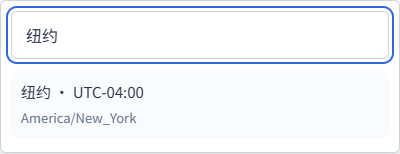
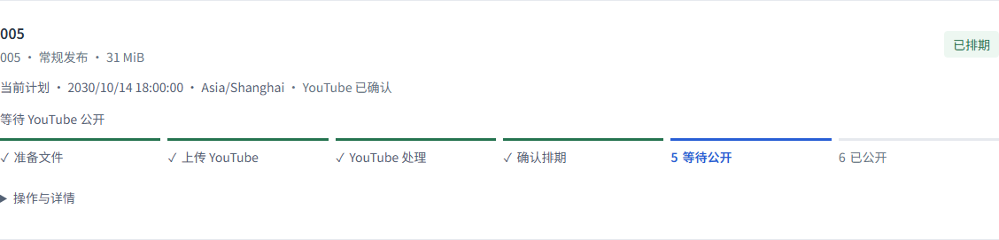
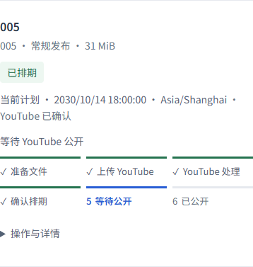
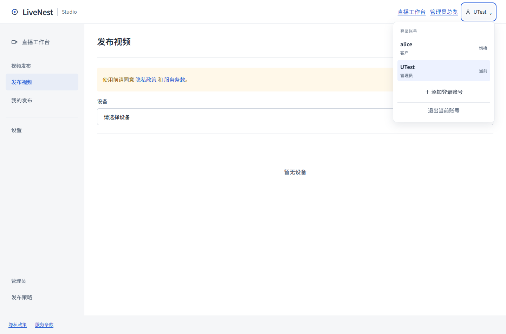

<!-- 文件用途：记录素材路径、时区、成员切换、执行阶段与排期精度修复的行为和验证边界。 -->
# 发布工作台易用性与排期修复

本次改动基于 0.1.11，合并、云端部署及新安装器发布分别记录；代码和模拟测试不能冒充已上线。

## 用户流程

准备素材时，选择电脑后自动读取其真实 `Publishing/Inbox` 路径，显示完整路径及复制按钮，不必先连接发布账号或点击检测。读取失败保留重试入口，设备离线明确说明需要目标电脑上线。目录来自 Agent 固定目录接口，不猜盘符或扫描浏览器所在电脑。获取路径不会把检测结果当作用户已检查素材；批次仍通过“检测素材”明确刷新和选择。

设置时间的时区改为真正可搜索的下拉选择器，按城市、IANA 名称或 UTC 偏移搜索；鼠标、键盘和手机均可选择。UTC 偏移按所选开始日期计算，确认后继续保存固定 UTC 时刻。自动排期跳过夏令时不存在的时刻，手动输入此类时刻会明确拒绝；重叠时刻使用第一次。单条改期采用任务的计划时区，预填现有时间；请求失败保留输入，Cloud 受理后立即显示新计划，并等待 Agent 核对。暂停任务改期仍保持暂停，异常、失败和取消中的任务明确拒绝改期。

执行页默认展示单条定时视频的六个阶段：准备文件、上传 YouTube、YouTube 处理、确认排期、等待公开、已公开。阶段区分完成、当前、后续及异常，暂停保留已完成事实，重试依据上传与处理证据定位阶段。私密和不公开任务以“已完成”结束。时间已到、文件已上传、HTTP 已受理均不能代替公开事实；只有已确认排期的视频能由 YouTube 在电脑关机后自动公开。视频不经过 GitHub 或 Cloud 存储。

阶段布局参考 [Atlassian Progress tracker](https://atlassian.design/components/progress-tracker/)；状态文字及符号参考 [Carbon Status indicators](https://v10.carbondesignsystem.com/patterns/status-indicator-pattern/)。主流程只保留当前阶段和必要信息，操作及诊断按需展开，长批次分页。

生成和保存期间锁定对应配置及时间输入，过期响应不能把用户带到旧计划。首次读取设备失败的刷新会重试完整上下文；配置保存后立即加入清单，不受紧接着的读取失败影响。素材和批次数量减少时，分页回到有效范围，保留可继续操作的内容。文案设置仍在“设置 → 发布配置”，确认日历中的单条视频可覆盖标题和说明。

## 网页成员切换

右上角点击成员名称，选择本浏览器已登录账号。添加新账号时首次输入密码；之后直接切换，不重新登录。切换重新载入整个工作台，以账号隔离既有草稿；其他标签页收到变更通知后刷新，旧页面请求还会校验预期成员，避免旧客户页面误用新的管理员身份执行操作。浏览器禁止存储通知时，旧身份请求被拒绝后重载当前身份，原控制操作不重放。

会话仍为原有十二小时，不因切换续期。最多保留六个有效登录，密码重置、停用、过期和注销即时失效。只退出当前账号，其他账号保留。凭据只在 HttpOnly Cookie 及服务端会话中，Cookie 使用 SameSite，HTTPS 使用 Secure；密码不保存在浏览器存储，账号清单没有 Token。桌面 Bearer 会话不能借用为网页会话。

## 产品开关与实际能力

删除“启用视频发布”和“允许自动公开”两道产品开关。它们原本分别用于灰度开放和人工验收标记，但不能解除 Google 的实际 API 项目限制，也不能证明排期生效。运行参数及预算仍由管理员配置，合规同意、身份及频道保护继续执行。旧字段保留在兼容协议内并归一为 true，不清理配置、不更改确认时间，也不因此恢复异常任务。管理员保存策略不再隐式恢复异常任务；用户明确点击“继续”时才同步最新策略。

未审核且满足官方条件的 API 项目仍可能只能私密上传，详见 [videos.insert](https://developers.google.com/youtube/v3/docs/videos/insert)。排期是否成功以远端回读为准，不能由一枚管理员勾选代替。

## 排期精度故障

2026-10-06 对用户已有两条视频做只读核查：本地拟提交时间含 `.501` / `.495` 毫秒，YouTube 已保存同秒的整秒 `publishAt`，旧代码按毫秒精确比较，误报排期未确认。随后只读回查到两条均已公开；没有重传、改期、写入 YouTube 或进行新的 OAuth。

新提交时间规整到整秒并保持配置提前量；旧检查点按同一 UTC 秒兼容，但不同秒仍视为不一致。确认后保存 YouTube 实际回读时间。旧误报只在用户明确核对、远端同秒排期及完整元数据相符时恢复，禁止借恢复覆盖人工排期。已公开时仅确认公开事实，无法回查的历史改期结果不冒充成功或失败。前端区分当前请求计划与已确认排期，不把整理阶段的候选时间写成生效时间。

总览和日历同步使用当前改期；旧报告不覆盖新计划，暂停或取消待应用时不沿用已确认结论。历史称“排期记录”，避免把未证实的旧候选写成真实公开时刻。

## 验证记录

2026-10-06 在 Windows 的最终代码树执行 `npm run verify`：类型检查、零警告 lint、87 个测试文件 / 786 个测试、8 项部署检查、Next.js 16.3.6 及 Agent 构建全部通过。

在隔离空数据服务 `127.0.0.1:3077` 上，Edge 执行 `node tests/publishing-ui.smoke.mjs` 与 `node tests/browser-accounts-ui.smoke.mjs`，全部 API 使用合成数据：100 包四步流程、返回和刷新保留草稿、改期失败保留输入、受理后读取失败、设备清单首次失败重试、素材减少分页、文案编辑、日历及历史、成员切换、两标签页同步、退出隔离、存储禁止时恢复均通过；320 / 390 / 1024 / 1440 宽度没有横向溢出。

真实数据仅进行了上述已有视频的只读核查；没有执行新的上传、OAuth、广播、电脑关闭验收或客户安装升级。当前修复尚未合并、部署或发布新安装器。

## 示例截图

以下均为浏览器模拟数据，不是客户电脑、实际频道或生产上传。

