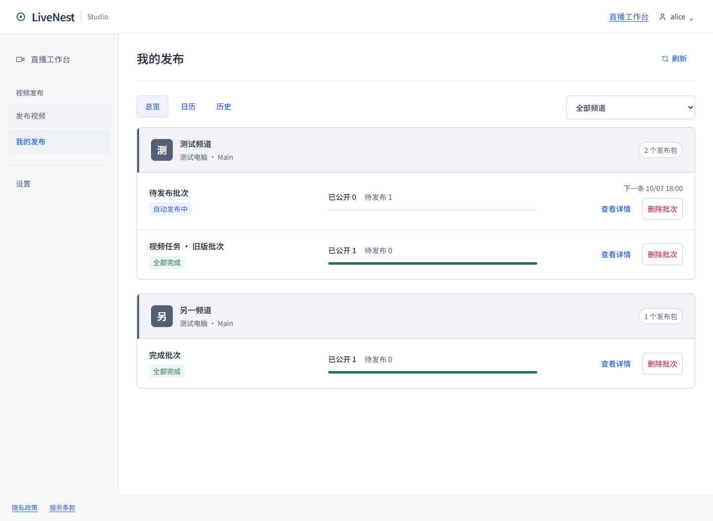
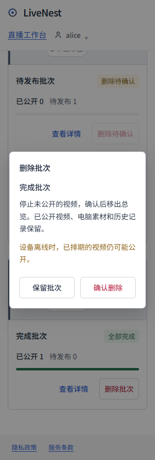

<!-- 文件用途：记录批次删除的用户流程、远端确认边界、兼容和实际验证。 -->
# 发布批次删除

## 用户流程

进入“我的发布 → 总览”，每个批次右侧的“删除批次”和“查看详情”并排显示。详情顶部、向导的自动执行页也提供删除入口。确认框显示批次名称和影响，可按 Escape 或“保留批次”返回；请求失败保留确认框，允许重试。

确认删除后，Cloud 一次保存该批次所有未安全结束任务的取消意图。批次继续显示“删除待确认”，任务进度仍可查看；已有 YouTube 排期在设备离线、取消失败或结果未知时仍可能公开，不能因为请求已受理就从列表消失。异常项保留单项取消重试和状态核对，批次不能继续上传、暂停或改期。

Agent 沿用现有取消协议：停止本地处理，对已经上传但未公开的视频清除排期并回读；末块结果未知先恢复视频关联。全部未公开视频的取消确认完成后，批次移出总览。已公开视频不会下架；公开视频赢得取消竞态时记录真实公开结果。私密或不公开视频的完成记录同样保留。

删除保留本地 Inbox/Working 素材、上传检查点、视频关联、配额账本和发布历史。它与将全部已完成素材搬到 Completed 的“归档批次”分别操作。旧扁平素材批次支持相同删除入口。已删除批次的浏览器旧草稿不会重新恢复，历史和日历仍可按原频道查看。

若授权失效触发既有数据清理，删除涉及的预期任务丢失不能视为成功。页面保留“删除未确认”的提示，提醒去 YouTube Studio 检查未公开排期；授权撤销本身不会取消远端排期。

## 实现与兼容

`POST /api/publishing` 增加 `batch-remove`，仅接受批次 UUID；Cloud 事务保存删除记录及取消修订，固定预期任务集合。`GET` 按当前设备权限返回最小 `removals` 标记，原计划和任务继续保留用于历史、防重复与恢复。重复删除请求不反复递增正在执行的取消修订，未上传任务也必须得到 Agent 确认。

仅当前修订的实际取消、真实公开或安全的私密/不公开完成允许移出总览。失败、旧报告、预算等待、丢失任务和未知会话均不能当作取消完成。已有授权清理和 API 数据保存期限保持原逻辑。

本次修改 Cloud 和网页，复用已发布 Agent 的取消能力，不修改桌面或 Agent 协议，不需要新安装包。尚未合并、尚未部署，不影响客户实际任务。

## 验证

- `npm run verify` 完整通过：88 个测试文件、803 个测试、8 项部署检查，以及类型检查、lint、Next.js 和 Agent 构建。
- `node tests/publishing-removal-ui.smoke.mjs` 通过：总览和详情的显眼入口、确认框键盘与焦点、请求失败原因和重试、取消等待与完成、旧批次、历史保留、删除后旧草稿、任务记录缺失，以及 320／390／1024／1440 宽度。
- `node tests/publishing-ui.smoke.mjs` 通过原有 100 包、四步发布、日历、历史搜索、独立账号、改期和草稿恢复流程。
- 浏览器使用隔离 localhost、真实 Edge 和合成 API 数据；未对客户频道、设备或素材执行取消、删除或上传。真实 Windows Agent 离线／重连及 YouTube 取消竞态仍需人工验收，不能用上述模拟结果替代。

## 示例截图

以下均为合成数据，不代表客户任务或生产取消结果。

