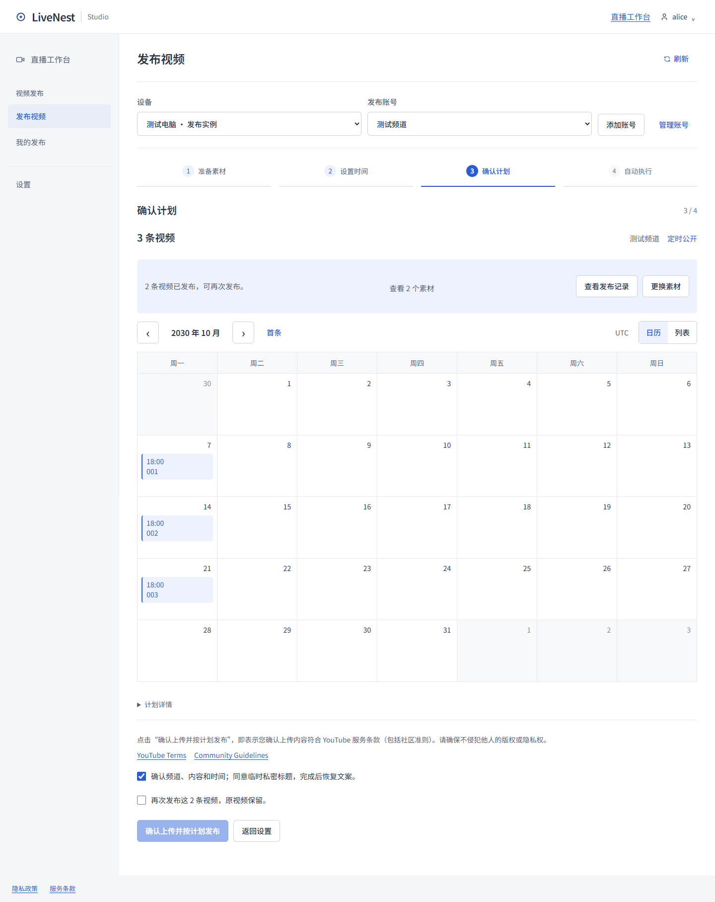
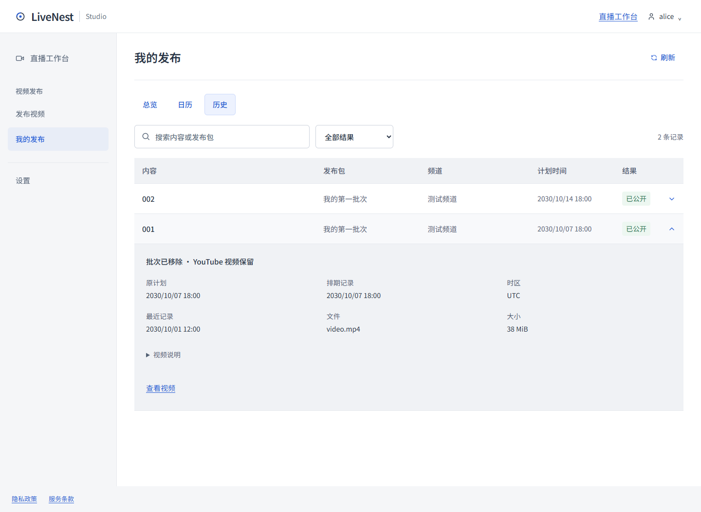
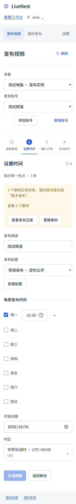

<!-- 文件用途：说明发布事实、主动再次发布、批次移除与未知上传保护的行为及验收边界。 -->
# 发布状态与重复素材

历史中的“已公开”表示 Agent 已观察到 YouTube 视频公开；计划日历只是本次预览，不能代表新视频已上传或排期成功。删除批次只停止尚未公开的任务并移出总览，原视频与历史保留。删除完成的公开视频详情明确显示“批次已移除 · YouTube 视频保留”。原计划和排期记录继续标为计划时间，不冒充真实公开时刻。

同一个视频可以主动发布多次。在“发布视频”中检测原素材、选择批次并重新排期，确认页会提示此前已完成的视频；勾选“再次发布这 N 条视频，原视频保留”后，再点击“确认上传并按计划发布”。无需修改文件名或删除旧视频。新计划建立独立任务、上传会话和 YouTube 视频；总览、执行及历史中的这一轮标记“再次发布”，公开数量只统计这一轮。已确认的计划返回修改时间仍是改期，不会把原计划改成再次上传。

素材检查及确认页按同一设备、同一频道和包 ID 对照权限内全部旧任务，包括已移出总览的批次和重新绑定账号之前的任务。只有当前修订已确认发布或有效完成、且授权没有异常的旧任务可以再次发布。早期步骤可继续设置，最终确认必须明确同意；修改计划修订、素材版本、排除项或此前上传记录集合后，需要重新勾选。混合批次可以对旧素材勾选“暂不发布”，继续其余内容。

Cloud 在确认事务内逐个核对用户明确选择的旧任务 ID、归属、设备、频道和本次素材；并发出现未确认上传时拒绝提交，要求核对。再次发布的追溯只保存于 Cloud 计划，Agent 接收原有兼容协议中的独立任务。刷新、丢失确认响应后重试、同时点击同一个计划的确认，都返回同一组任务，不会自动多上传一轮。已经再次发布的内容如要第三次发布，仍须创建新计划并确认。

上传中、处理中、等待公开、尚未确认取消和未知上传结果继续阻止新的上传，不能用“再次发布”绕过。已确认取消且从未开始上传的任务可以重新建立；已上传后取消且素材版本变化的替代任务仍须明确勾选确认。文件版本不是完整内容 Hash，不指导用户通过改名或修改时间绕过未知结果核对。故障恢复继续使用原 session 和 videoId，不等于主动再次发布。

确认上传或改期失败的原因显示在当前计划修订的按钮附近；切换到历史不会显示这个草稿错误，返回原修订仍可查看。背景轮询不清空失败原因，计划修订后旧确认错误不再显示。其他操作错误绑定所在主页面和设备账号，状态读取失败仍提示重新查询。

本轮继续更新 PR #30，尚未合并或部署。再次发布不需要 Agent 协议迁移，原 PR 中的 Runner 取消恢复改动仍需新版 Agent。未执行新的真实上传、OAuth consent、广播或客户视频下架。

## 验证

- `npm run verify` 完整通过：91 个测试文件、862 个测试、8 项部署检查，以及类型检查、lint、Next.js 和 Agent 构建。随后补充并发确认回归，发布计划、Cloud 与批次删除三文件 115 项定向测试通过。
- 单元测试验证主动再次发布生成独立任务、原视频与历史保留、同计划重复及并发确认幂等、归属与任务集合校验、未知结果与旧修订阻止、混合替代上传，以及 API 文案清理后仍保留发布事实。
- `node tests/publishing-upload-review-ui.smoke.mjs` 通过：再次发布必须显式同意、提交旧任务 ID、确认响应丢失后的同计划重试、旧视频与历史保留、本轮统计独立、总览及历史标记再次发布、排除候选或新增旧记录重置同意、未知结果阻止、错误归属与持久草稿；320／390／1024／1440 无横向溢出，共 20 张示例截图。浏览器中的幂等由合成响应模拟，真实 Cloud 幂等另由上述后端测试验证。
- `node tests/publishing-ui.smoke.mjs` 和 `node tests/publishing-removal-ui.smoke.mjs` 通过既有 100 包、四步、日历、多账号、草稿、历史、批次删除、设备离线及恢复回归。
- 浏览器验收使用隔离 localhost 与合成 API 响应，未执行真实上传或向 YouTube 发送请求。自动化证据不能替代真实 YouTube 上传验收。

## 示例截图

以下为合成状态，未使用客户任务或真实视频。

