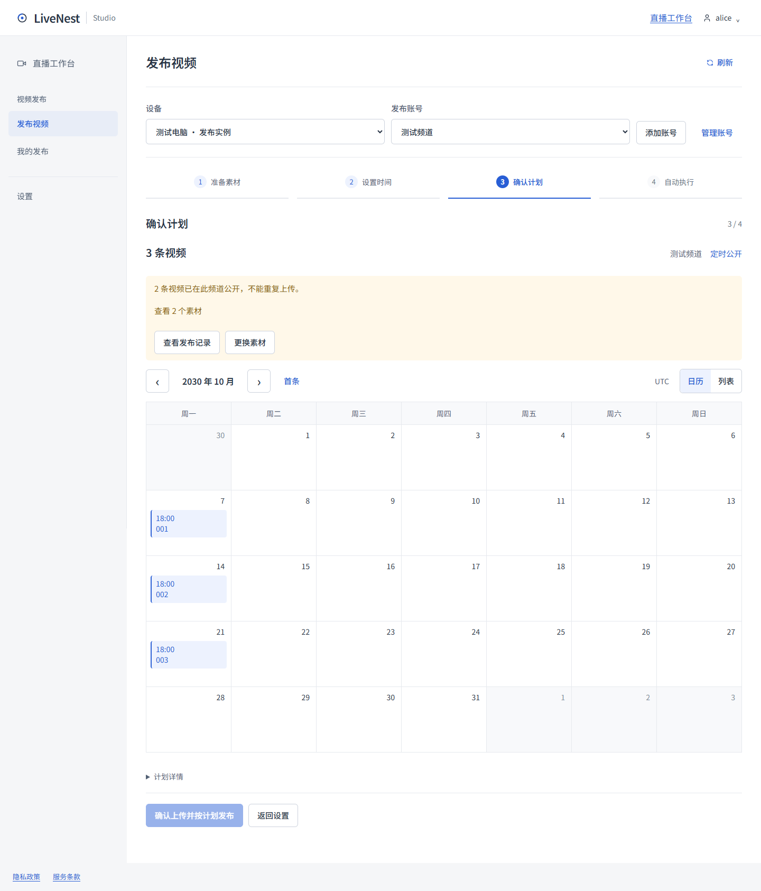

<!-- 文件用途：说明发布事实、批次移除和重复素材预检的用户行为及验收边界。 -->
# 发布状态与重复素材

历史中的“已公开”表示 Agent 已观察到 YouTube 视频公开；计划日历只是本次预览，不能代表新视频已上传或排期成功。删除批次只停止尚未公开的任务并移出总览，原视频与历史保留。删除完成的公开视频详情明确显示“批次已移除 · YouTube 视频保留”。原计划和排期记录继续标为计划时间，不冒充真实公开时刻。

同一素材再次排期时，素材检查及确认页对照权限内全部旧任务，按同一设备、同一频道和包 ID 检查，包括已移出总览的批次和重新绑定账号之前的任务。已公开的素材显示“已在此频道公开”，提供“查看发布记录”和“查看视频”；新草稿确认页可点“更换素材”。混合批次可以对已有记录的素材勾选“暂不发布”，然后继续其余内容。预检阻止重复确认，Cloud 确认事务仍进行最终校验，避免并发状态变化绕过检查。

尚未确认取消的任务、未知上传结果、已有上传记录但素材版本未变化，均保持原有阻止规则。已确认取消且从未开始上传的任务可以重新建立；已确认取消且素材版本变化的替代任务必须继续明确勾选确认。文件版本不是完整内容 Hash，不以改名或修改时间指导用户绕过重复上传保护。已公开或普通完成的任务不会自动成为可替代上传。

确认上传或改期失败的原因显示在当前计划修订的按钮附近；切换到历史不会显示这个草稿错误，返回原修订仍可查看。背景轮询不清空失败原因，计划修订后旧确认错误不再显示。其他操作错误绑定所在主页面和设备账号，状态读取失败仍提示重新查询。

本轮继续更新 PR #30，尚未合并或部署。网页改动不需要协议迁移，原 PR 中的 Runner 取消恢复改动仍需新版 Agent。未执行新的真实上传、OAuth consent、广播或客户视频下架。

## 验证

- `npm run verify` 完整通过：91 个测试文件、830 个测试、8 项部署检查，以及类型检查、lint、Next.js 和 Agent 构建。完整检查后补充的浏览器脚本单独通过 ESLint。
- 单元测试覆盖已公开同版本及新版本、完成任务、排除项、未上传取消、已上传取消、取消旧修订、跨授权账号和实例但同设备频道、不同设备频道，以及 API 文案清理后上传证据保留。
- `node tests/publishing-upload-review-ui.smoke.mjs` 通过：提前阻止重复确认、直接查看历史并返回保留草稿、排除重复项后继续、刷新保留排除、服务端确认失败只显示在原修订、第二步后台出现重复记录时说明原因并禁用生成；320／390／1024／1440 无横向溢出，16 张示例截图。
- `node tests/publishing-ui.smoke.mjs` 和 `node tests/publishing-removal-ui.smoke.mjs` 通过原有 100 包、四步发布、日历、多账号、草稿、历史和批次删除流程。草稿切换回归改用全新合成批次；不再让旧 mock 默认允许重新发布此前已公开归档的素材。
- 浏览器验收使用隔离 localhost 与合成 API 响应，未执行真实上传或向 YouTube 发送请求。自动化证据不能替代真实 YouTube 上传验收。

## 示例截图

以下为合成状态，未使用客户任务或真实视频。

