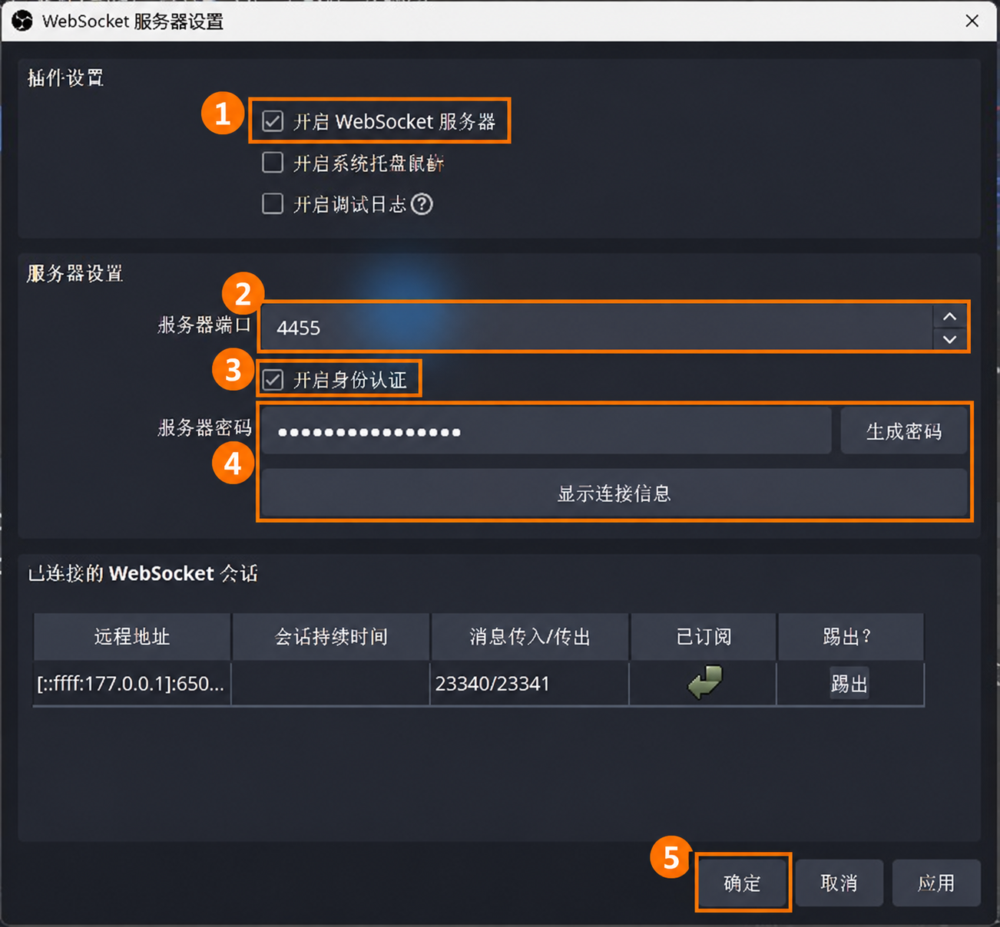

<!-- 文件用途：逐步说明 LiveNest Windows 安装、离线登录、OBS、配对、网页协作与恢复。 -->
# 桌面配置与网页协作

安装版名称是 **LiveNest**。导师电脑负责运行 OBS 和 Agent，网页负责频道授权、素材和开停播。导师电脑不需要 Node、Git、Docker、源码、终端或环境文件。

## 1. 下载与安装

1. 在导师的 Windows 10/11 **x64** 电脑打开 [安装包发布页](https://github.com/Doris619619/LiveNest-Releases/releases)。选择明确标为已发布的最新版本，下载 `LiveNest_<版本>_x64-setup.exe`。如果没有版本，表示尚未发布；不要把源码 ZIP 当作安装器。
2. 双击安装器，按向导选择安装位置。默认是 `%LOCALAPPDATA%\Programs\LiveNest`，只为当前 Windows 用户安装；也可选择其他可写目录。
3. 完成后，从桌面或开始菜单打开 **LiveNest**。账号输入 **Do**，密码使用维护者给出的客户端密码。密码不会自动填入，不写入本文或日志。
4. 登录后进入“设备配置”。四个侧栏入口为“设备配置”“本机 OBS”“帮助”“设置”。整个配置页始终保留，关闭窗口后可继续。

客户端登录和网页登录是两个独立会话。退出客户端登录只锁住界面，Agent 继续运行；关闭窗口进入托盘。要结束后台程序，右下角托盘右键 LiveNest → 退出。普通退出不申请云端维护锁，离线也能退出；先停止接收新任务，并等待已接收任务处理完毕和 Agent 实际退出。配置中或 Agent 未确认结束时明确提示重试，不强杀进程。退出程序保持 OBS 运行，网页将暂时无法控制这台电脑；客户端内重启更新仍要求维护确认。

## 2. 文件夹由程序创建

| 内容 | 默认位置 | 是否随更新保留 |
| --- | --- | --- |
| 安装程序、内置 Node、Agent、OBS 原始包、离线图片 | `%LOCALAPPDATA%\Programs\LiveNest` | 安装资源替换 |
| 加密设备配置 | `%APPDATA%\LiveNest\settings.json` | 保留 |
| 便携 OBS | `%LOCALAPPDATA%\LiveNest\obs\main`，后续为 `obs_<随机值>` | 保留 |
| 视频与音乐 | `%LOCALAPPDATA%\LiveNest\media\<实例ID>\videos`、`music` | 保留 |
| 频道令牌、任务记录 | `%LOCALAPPDATA%\LiveNest\state` | 保留 |
| 日志目录 | `%LOCALAPPDATA%\LiveNest\logs` | 保留 |

不用手动建文件夹。首次准备 OBS **之前**，可以打开“设置 → 数据位置 → 选择文件夹”。例如选择 `D:\直播`，程序使用 `D:\直播\LiveNest`。已有 OBS 或设备身份后禁止直接换目录，避免丢失引用。普通卸载保留配置和媒体；不要把卸载当作清除身份的操作。

配置用 Windows 当前用户加密，频道令牌使用独立加密密钥；复制密文到另一台电脑不是迁移方法。第一版不自动迁移旧 Agent，也不接管原有电脑身份。

## 3. 按设备配置页完成六步

### ① 检查电脑

点击“检查电脑”。确认 Windows x64、目录可写、至少 3 GB 剩余空间、安装资源完整、网页服务可访问。3 GB 只用于起步，多个 OBS 和视频需要额外空间。失败时按该项说明修复，再点“重新检查”。断网时仍可登录和查看离线帮助。

### ② 准备 OBS

无需预先安装 OBS。点击“自动准备 OBS”，使用安装包内置便携版，等待解压、启动和连接检查。第一次会出现独立 OBS 窗口，属于正常现象。内置资源缺失时重新安装完整 LiveNest 包；解压失败保留候选可重试，手动路径不存在时明确提示，不会卡着等待 WebSocket。

程序创建独立的 OBS 32.2.2 便携目录、自动选择空闲端口、生成随机密码，创建 `LIVE` 场景和 `VIDEO`、`MUSIC` 媒体源，关闭全局桌面与麦克风采集。输出默认 1280×720、30 FPS、x264、4000 Kbps；视频循环、等比例适配，默认关闭视频原声。再次点击会检查原实例，不会重复创建或重写已完成配置。

不要删除正在配置的目录。若中断，重新打开客户端，在“本机 OBS”对对应实例点击“启动并检查”。“已配置”意味着已验证 WebSocket 认证和标准场景结构，不等于素材已经选好或真实直播音画已验收。

### ③ 连接网页

1. 点击“打开网页，添加直播电脑”，系统默认浏览器打开 [LiveNest 工作台](https://livenest.duckdns.org/#workspace)。
2. 在网页用成员账号登录；客户端的本地登录不会替你登录网站。
3. 点击侧栏“添加直播电脑”，输入容易识别的电脑名称，生成配对码。
4. 点击“复制配对码”，返回客户端，粘贴到第③步，点击“连接”。有效期十分钟；复制失败或过期时，展开网页“查看配对码”手动复制或重新生成。连接成功后配对表单自动隐藏。
5. 等待“设备在线”。客户端保存设备身份并启动内置 Agent，随后取得云端 Google 应用配置。导师不用填写 Client ID 或 Client Secret。

已有电脑也能直接使用网页新生成的配对码。客户端自动证明原身份，云端将新邀请用于恢复原电脑；设备 ID、密钥、OBS 和频道授权保留，无需手工找旧设备。配对响应丢失可重试同一个码，也可生成新码重试。不要删除加密配置。

### ④ 连接频道

点击“前往网页授权”。工作台定位到本设备；展开对应 OBS → 设备与频道 → 授权/重新授权。在系统浏览器中完成 Google 登录和频道选择。每个 OBS 必须绑定不同频道，已有频道不能重复绑定到其他实例。Google 同意页面由频道持有人自行确认。

等待客户端第④步显示频道名称。看到“设备在线”但频道“尚未授权”时，应完成这一步，不能直接认为可以开播。

### ⑤ 准备素材

在网页点击“上传素材”，选择**这台电脑与正确的 OBS 实例**，分别上传视频和背景音乐。传输完成后展开该实例的“音视频编排”，选择循环视频、背景音乐及是否开启视频原声。文件到达对应电脑的独立素材目录，不要求用户手工复制。

客户端显示每个实例收到的视频、音乐数量。数量大于零只是文件已经收到；实际播放哪一份仍以网页下拉框的选择为准。

### ⑥ 完成检查与第一次直播

回到客户端点击“重新检查”。设备在线、每个 OBS 就绪、频道已授权、素材存在才显示配置就绪。过期快照不会当作当前状态。

由用户主动在网页点“开始直播”。等待 OBS 推流状态和 YouTube 状态确认，打开真实直播页面核对画面比例、循环、音乐、视频原声和卡顿情况。结束时点击“结束直播”，等待 OBS 停止且 YouTube 直播结束；请求被接受不代表已完成。电脑应保持开机、联网、不休眠、Windows 用户已登录。多个 x264 OBS 的 CPU 消耗明显，应逐个增加并观察实际负载。

## 4. 多个 OBS 与已有 OBS

自动增加：先结束**这台电脑所有实例**的直播、上传和频道授权，等待状态刷新；“本机 OBS → 增加 OBS”。每个实例都有独立程序、端口、密码和素材目录。已配对设备会先进入云端维护，登记实例后重启 Agent，再释放维护；旧实例 ID 和频道绑定保留。网页随后出现新实例，再给新实例授权不同频道。修改名称不修改 ID。

手动接入：准备一个专用便携 OBS，按[原图文教程第 5 步起](../配置.md)设置场景、媒体源、全局音频、WebSocket。然后“本机 OBS → 接入已有 OBS”，输入端口与密码，点击“选择 obs64.exe 并检查”，选择该便携目录里的 `bin\64bit\obs64.exe`。程序只验证手动 OBS 的场景，不自动重写它。不要选择旧 Agent 正在使用的实例。

客户端“帮助”内置与原教程一致的已标注截图，断网可用：WebSocket、场景、媒体源、全局音频、输出、画面适配等。

首次手动接入输错端口或密码时，在“本机 OBS → 修正手动 OBS 连接”选择原实例，重新填写后保存并检查，不要重新创建实例。配对之后请保持 OBS 原连接设置；外部修改密码会导致 Agent 断开，应先在 OBS 恢复原设置。

其余步骤及全部图片见[手动配置图文教程](../配置.md)。

## 5. 常见问题

开发分支新增反馈（尚未包含在公开 0.1.0）：配置步骤旁显示实际阶段、端口及本次操作用时；失败原因留在该步骤，点击“重新检查 OBS”继续检查现有实例，不重复新增。切换侧栏或退出登录后再登录可恢复后台操作反馈。关闭整个程序后仍保留实例配置，重新检查继续；不保留上一轮计时。手动接入密码错误时，在“本机 OBS”修正连接信息后检查。

若 0.1.0 一直等待后超时，先向页面顶部查看具体错误。不要删除配置或结束未知 OBS。可能需要确认是否有此前隔离测试目录中的 OBS 被错误识别；请维护者按实际运行文件和端口确认归属、验证未推流和未录制后再处理。后续修复改用内核文件路径识别，详见[验证记录](desktop/OBS准备反馈修复.md)。

| 现象 | 下一步 |
| --- | --- |
| 登录提示账号或密码不正确 | 区分大小写，检查账号 Do；连续五次失败等待一分钟 |
| 网页服务不可达 | 检查网络和网站可否在系统浏览器打开，再重试；无需安装 Docker |
| 配对过期或无效 | 在网页生成新码，复制后粘贴连接；无需选择原设备 |
| 目录不可写 | 首次配置前选择自己的可写文件夹；已有配置不要删除或重置 |
| 磁盘不足 | 释放空间后重试，媒体另需空间 |
| OBS 初始化中断 | 对同一实例重试；不要改 `.livenest-owner` 或复制别的配置进去 |
| OBS 连接/认证失败 | 确认对应 OBS 已启动、端口一致、WebSocket 已启用且密码一致，打开帮助图解核对 |
| 端口被其他程序占用 | 不要结束未知进程；新实例会选空闲端口，已初始化实例需解决占用后重试 |
| 维护未确认 | 结束所有实例直播、上传及授权，等待实时状态；断网时不能猜测可以重启 |
| 维护后中断 | 回到“本机 OBS”完成未成功配置，再“连接网页 → 重新连接”，保留原配置文件 |
| 更新失败 | 当前版本继续使用，在设置重新检查；关闭窗口和普通退出不会偷偷安装 |
| 配置无法解密 | 使用原 Windows 账户，保留文件，不要清空身份 |

## 6. 移除电脑后重新配置（待发布）

在网页对应电脑的标题旁点击“移除电脑”，阅读说明并确认。设备从工作台隐藏，原电脑的 OBS、素材和频道授权均保留；正在运行的 OBS 和直播不会被停止。移除后不要删除本机身份文件。

需要恢复时直接生成新配对码，在原 Windows 用户的 LiveNest 第③步粘贴并点击“连接”。普通断网无需重新配对；确需使用新码时可展开“粘贴新的配对码”。恢复仍验证客户端保存的原凭据，不能接管其他电脑或旧 OBS。已消费邀请不会成为重复电脑；网页成功入口指向原设备。旧版客户端仍可通过折叠入口选择原电脑恢复。本功能需要升级云端和此分支客户端，本地安装包不等于网页已部署。

## 7. 设置页

开发分支的设置页沿用网页工作台布局：名称和当前值在左侧，操作在右侧；自动启动使用同款开关。数据位置显示完整路径，“打开文件夹”只打开当前设备的数据目录。首次配置前可“选择文件夹”，已有 OBS 或待完成配对身份时保留原目录，不提供迁移按钮。更新状态和版本显示在同一行，按实际阶段提供检查、下载或重启操作，下载中显示真实百分比；维护保护照常生效。

有新版时，顶部右侧会显示“更新”；点击查看版本并下载。下载完成显示“重启更新”，不会自动弹出详情或自行重启。可关闭详情继续配置，稍后再操作；原有直播和维护保护仍生效。该主界面入口为开发分支新增功能，当前 0.1.0 仍需在设置中查看更新。

## 7. 连接原理

`浏览器 → HTTPS 云端 → 主动连接云端的 Agent → 127.0.0.1 上的 OBS`。

OBS 只通过本机连接被控制，不需要路由器端口转发或自动添加入站防火墙规则。频道令牌和媒体留在直播电脑。客户端页面全部来自安装包，通过受限 IPC 访问主进程；外部网站和 Google 登录始终使用系统浏览器。

本地 Do 登录是共享客户端的界面访问控制，不替代 Windows 用户权限。具备本机管理员权限的人仍能控制本机程序。它不改变网页登录账号、频道授权和云端设备身份。

设备身份和 Google 应用凭据由客户端加密保存；OBS 自身要求 WebSocket 密码写在它的插件配置中，应把数据目录放在当前 Windows 用户的私有目录，不要共享整个 OBS 配置文件夹。Agent 使用本机地址连接；官方 OBS WebSocket 仍会监听系统网络接口，因此不要为它添加公网转发或放宽入站防火墙。
