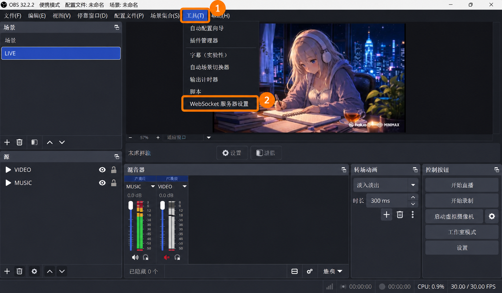
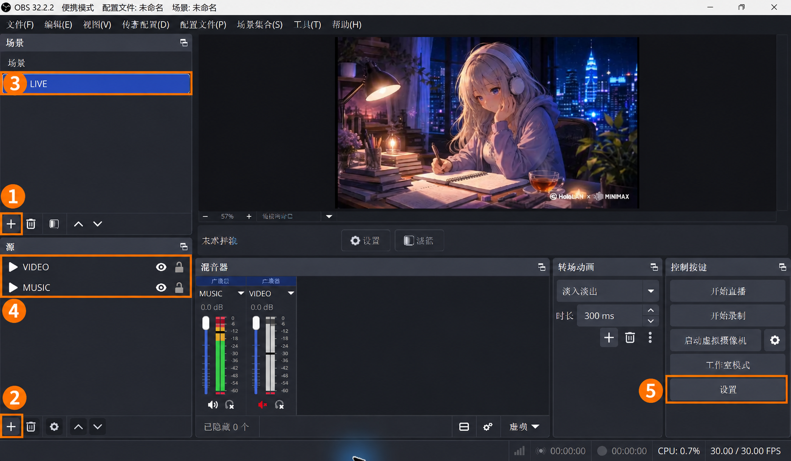
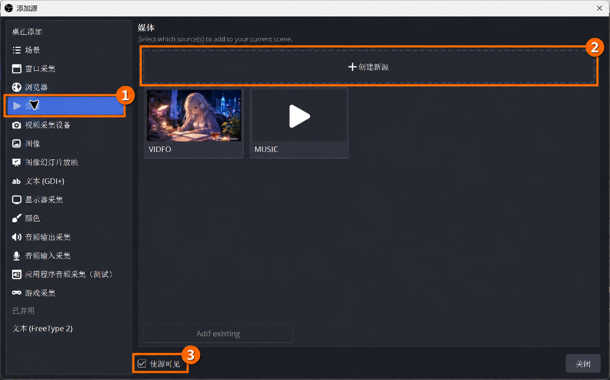
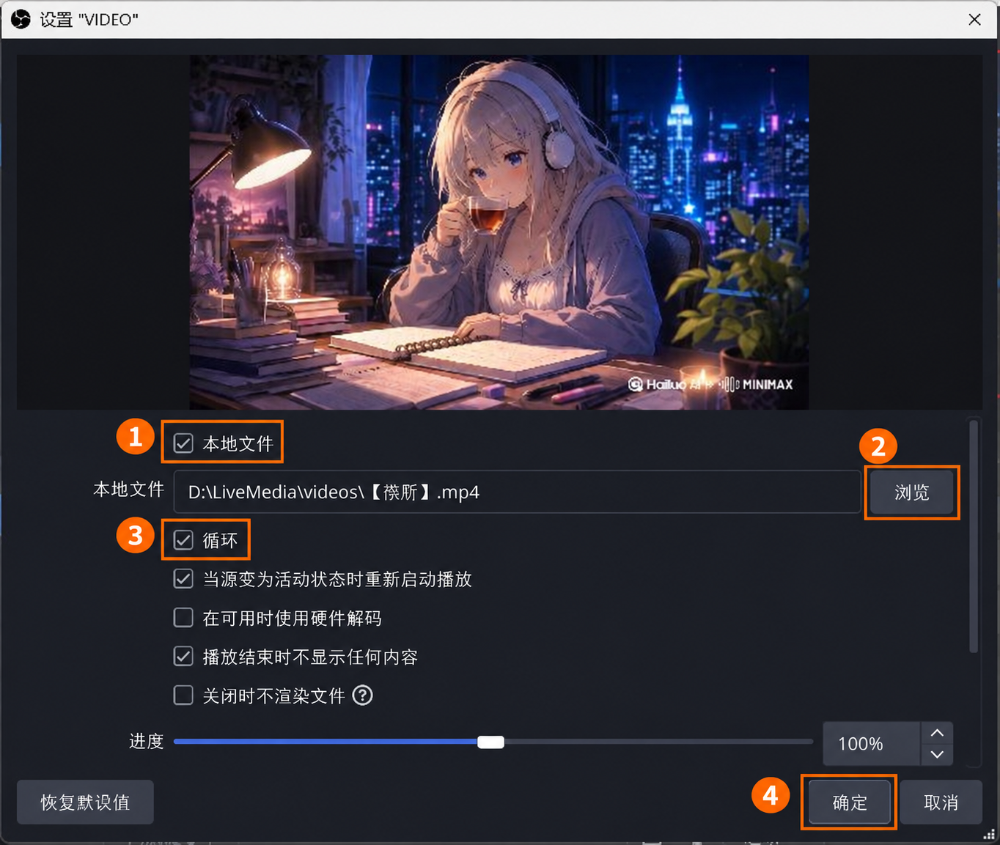
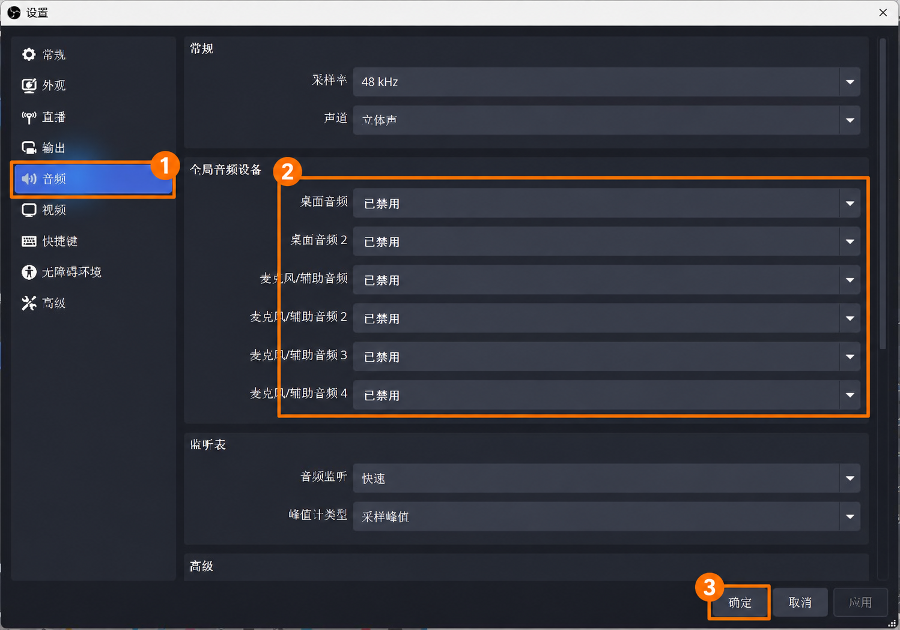
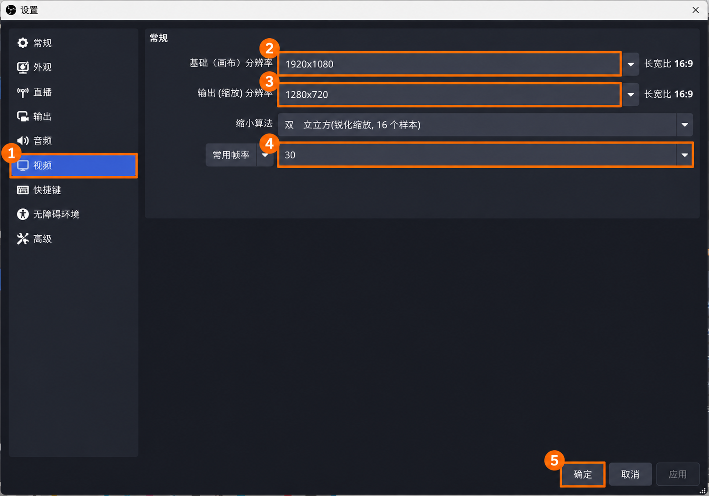
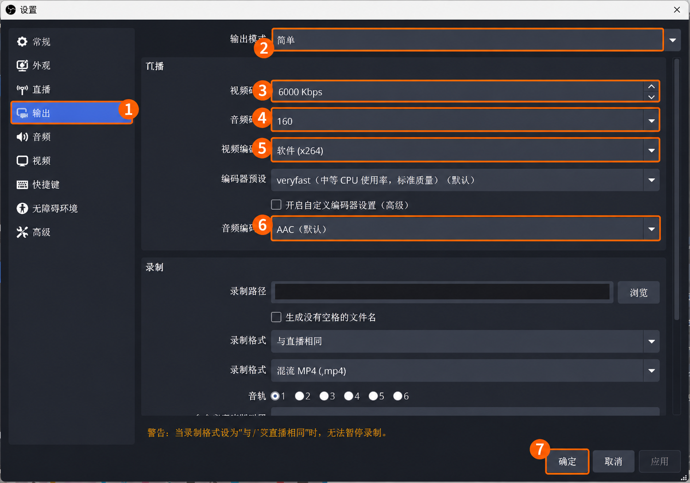
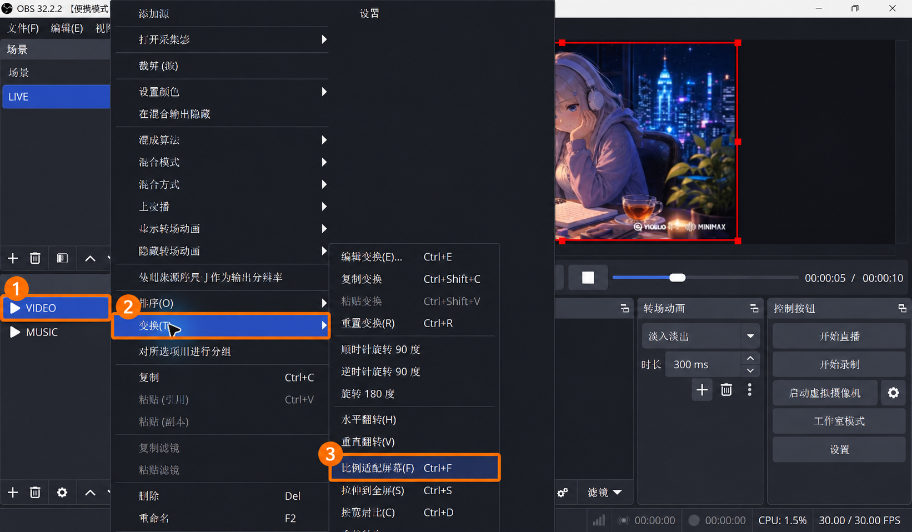

<!-- 文件用途：指导新手把一台 Windows 直播电脑接入 LivePilot 云端，逐步完成目录、OBS、Agent、频道授权和真实开停播验收。 -->
# 新电脑接入与 OBS 配置图文教程

**新电脑优先使用 [LiveNest 安装版](docs/桌面配置与网页协作.md)**：安装器内置 Node、Agent、OBS 和下方图解，自动完成独立 OBS 配置；无需下载源码、装 Git/Docker 或编辑环境文件。本文保留给手动接入、已有 OBS 和旧版本维护使用。打包与更新见[桌面安装与发布](docs/桌面安装与发布.md)。

LiveNest 是本项目的网页直播控制台。你在自己的电脑打开网页，选择视频和音乐，远程控制另一台 Windows 电脑上的 OBS 向 YouTube 直播。本仓库是 [Doris619619/LivePilot-v2](https://github.com/Doris619619/LivePilot-v2)，与旧 LivePilot 仓库独立。

**本文按“把导师的一台 Windows 电脑接入已有云端，先接一个 OBS、一个频道”从头写起。没有操作经验也请按编号依次做；每一步都写了在哪台电脑操作、文件放哪里、如何检查。**

<a id="contents"></a>
## 先选对入口

| 你要做什么 | 从哪里开始 |
| --- | --- |
| 只用网页控制已接入的设备 | 管理员给你网址和成员账号后，直接看[第 10 步](#step-10)；你的操作电脑不安装 Agent |
| 把导师/另一台 Windows 电脑接入现有云端 | 从[第 0 步](#step-0)开始，顺序做到第 13 步 |
| 还没有服务器、域名和云端控制台 | 管理员先完成[云端从零部署](docs/从零部署.md)，再回来接设备 |
| 已有本机版本，要迁移到 Agent | 先看[旧电脑迁移](#migration)，不要按新电脑流程覆盖数据 |
| 只在一台电脑本地使用，不接云端 | 看[本地模式与多实例](docs/本地模式与多实例.md)；OBS 配置仍按本文第 3～5 步 |
| 一台电脑需要多个 OBS | 配对前先看[多实例配置的时机与限制](#more-instances)，首次上线前确定清单 |

步骤导航：[0 准备资料](#step-0) · [1 建文件夹](#step-1) · [2 安装 Node 和下载 Agent](#step-2) · [3 安装 Portable OBS](#step-3) · [4 设置 WebSocket](#step-4) · [5 场景/媒体/音频/画面](#step-5) · [6 填 Agent 配置](#step-6) · [7 Google 配置](#step-7) · [8 配对](#step-8) · [9 启动与诊断](#step-9) · [10 网页操作](#step-10) · [11 测试开停播](#step-11) · [12 登录自启](#step-12) · [13 日常使用](#step-13) · [故障表](#troubleshooting)。

### 三个地方，各自做什么

```text
你的电脑/手机：浏览器打开控制台，登录、传素材、点开停播
                         │ HTTPS
云端服务器：管理成员账号、配对设备、传递命令和状态
                         │ 导师电脑主动向云端连接
导师的 Windows 电脑：Agent → 本机 OBS → YouTube
                     └── 保存视频、音乐、频道授权
```

**Agent 是项目自带的后台程序**，不是 OBS 插件，目前没有单独的双击安装包。后面说的“安装 Agent”，就是下载项目、安装依赖、构建、填写配置、配对，然后运行它。OBS 编码并发送直播音视频；云端不转发直播音视频，只中转上传素材的有限分片。

导师电脑要持续开机、联网、不休眠，并保持 Windows 用户登录。关闭你的网页不会停止已经运行的直播；导师电脑断电、退出登录或 OBS 退出会影响直播。设备离线不代表直播已经停止。

<a id="step-0"></a>
## 0. 先准备资料，别在中途猜参数

**谁做：云端管理员 + 导师。此时还不要生成配对码，它只有 10 分钟有效期。**

| 要准备什么 | 本文示例 | 向谁取得 / 如何确认 |
| --- | --- | --- |
| 云端控制台网址 | `https://studio-example.duckdns.org` | 管理员提供真实网址；浏览器能打开且没有证书警告 |
| 域名，不带协议和路径 | `studio-example.duckdns.org` | 从上面的真实网址提取；后面 `--domain` 只填这一段 |
| 网页成员账号和密码 | 用户名 `mentor` | 可使用内置 `Do` 或云端管理员创建的成员；不是 Google 账号 |
| 新电脑的设备 ID | `mentor_pc` | 管理员确认全局没有用过；以后保持不变 |
| 设备显示名称 | `导师电脑` | 管理员创建配对码时填写 |
| OBS 实例 ID | `main` | 第一份固定用 `main`；它不是设备 ID，也不是频道 ID |
| GitHub 仓库访问权限 | 能打开本仓库页面 | 私有仓库先由管理员给导师的 GitHub 账号授权 |
| Google Client ID / Client Secret | 不在本文提供实际密钥 | 管理员提供同一 OAuth 客户端的一对值，第 7 步说明来源 |
| 要直播的 YouTube 频道 | 导师确认的频道名称 | 持有人能登录，并且该频道没有绑定到另一台设备/另一实例 |
| 一段测试视频 + 一段测试音乐 | `test-video.mp4`、`test-music.mp3` | 使用自己有权使用、在本机能播放的文件，不能是空文件 |

**示例域名不能直接用。** 本文只固定目录名和示例设备名，域名、密码、Google 凭据必须换成管理员提供的真实值。首次开通频道直播可能需要等待，提前在 [YouTube Studio](https://studio.youtube.com/) 点击“创建 → 开始直播”，按平台提示完成验证/开通；参见 [YouTube 直播入门](https://support.google.com/youtube/answer/2474026?hl=zh-Hans)。

本文适用于 Windows 10/11 的常见 x64 电脑。ARM 设备应先由管理员确认 OBS 和运行环境兼容性。先获得导师同意，在空闲窗口初始化专用 OBS；不要把正在工作的 OBS 直接改成教程配置。如果计划一台电脑接多个 OBS，请在首次启动 Agent 前完成[多实例配置](#more-instances)，当前版本不支持已上线设备直接增删实例清单。

<a id="step-1"></a>
## 1. 在导师电脑建立固定文件夹

**操作位置：导师的 Windows 电脑。** 本文统一用 `C:\LivePilot`，这样没有 D 盘也可以照做。不要放在“下载”临时目录或云盘同步目录，也不要安装到 `C:\Program Files`。

1. 打开文件资源管理器，地址栏输入 `C:\`，按 Enter。
2. 新建文件夹，命名为 `LivePilot`。
3. 打开它，新建 `apps`、`media` 两个文件夹。
4. 打开 `apps`，新建 `obs-main`。
5. 打开 `media`，新建 `videos`、`music`。
6. 把一段真实测试视频复制到 `videos`，一段真实测试音乐复制到 `music`。为了容易对照，可分别重命名为 `test-video.mp4` 和 `test-music.mp3`；**不要靠修改扩展名把其他格式伪装成 MP4/MP3**。

也可以在开始菜单搜索 **PowerShell**，打开普通 Windows PowerShell，一次执行下面这段创建目录；它不会删除已有文件：

```powershell
New-Item -ItemType Directory -Force -Path 'C:\LivePilot\apps\obs-main','C:\LivePilot\media\videos','C:\LivePilot\media\music' | Out-Null
```

**若 C 盘根目录没有写入权限：** 请管理员给这个专用目录授予当前 Windows 用户写入权限，或从一开始改用自己的用户目录，例如 `C:\Users\你的用户名\LivePilot`，并把全文所有 `C:\LivePilot` 一致替换。不要为解决目录权限而日常以管理员身份运行 Agent。

最终目录会是这样；`agent` 由第 2 步的 clone 命令自动创建，不用提前再建一个同名嵌套文件夹：

```text
C:\LivePilot\
├─ agent\                        项目代码，后续所有 npm 命令在这里执行
│  ├─ package.json
│  ├─ .env.agent                  第 6 步生成的私有配置
│  ├─ dist\agent.cjs              第 8 步构建生成
│  └─ .data\                     配对身份、授权和运行状态，程序自动生成
├─ apps\
│  └─ obs-main\
│     ├─ bin\64bit\obs64.exe      第 3 步解压后应能找到
│     ├─ data\
│     ├─ obs-plugins\
│     ├─ portable_mode.txt        第 3 步创建，空文件
│     └─ config\                 OBS 首次运行后自动生成
└─ media\
   ├─ videos\test-video.mp4
   └─ music\test-music.mp3
```

**完成标准：** 两个媒体文件能在导师电脑上双击正常播放。素材直接放在 `videos` / `music` 内，不要再套子目录。视频扩展名支持 `.mp4/.mkv/.mov/.webm/.avi/.m4v`，音乐支持 `.mp3/.wav/.flac/.aac/.m4a/.ogg`；具体编码仍需 OBS 能解码。

<a id="step-2"></a>
## 2. 安装 Node.js、Git，下载 Agent 程序

**操作位置：导师电脑。** 首次安装一次即可。下面所有 Windows 命令用 `npm.cmd`，避免 PowerShell 把 `npm` 解析成受执行策略限制的 `npm.ps1`；不需要全局放宽脚本策略。

### 2.1 安装 Node.js

1. 浏览器打开 [Node.js 官方下载页](https://nodejs.org/en/download)。
2. 选择 **24.x LTS → Windows → x64 → Windows Installer (.msi)**。项目也接受 22.23+ 的 22 系列；不要装较旧的 22.x 或 Node 20。
3. 双击下载的 `.msi`，按向导安装，保留 npm 和加入 PATH 的默认选项。教程不需要额外勾选本机构建工具安装包。
4. 安装完成后关闭旧 PowerShell，再从开始菜单重新打开一个。
5. 分别执行：

```powershell
node --version
npm.cmd --version
```

**完成标准：** 第一条显示 `v24...`（或满足要求的 `v22.23...` 及更高 22 系列），第二条显示 npm 版本号；不能出现“无法识别”。

### 2.2 安装 Git

1. 打开 [Git for Windows 官方下载入口](https://git-scm.com/install/windows)，下载 x64 安装程序。
2. 运行安装向导，保留默认项；PATH 选项保留可从命令行和第三方软件使用 Git，保留 Git Credential Manager。
3. 安装完成后重新打开 PowerShell，执行：

```powershell
git --version
```

**完成标准：** 显示 `git version ...`。

### 2.3 下载本项目

先用有仓库权限的 GitHub 账号在浏览器打开本仓库。如果显示 404，先让管理员确认访问权限。然后在导师电脑的 PowerShell 逐条运行：

```powershell
Set-Location 'C:\LivePilot'
git clone --branch main https://github.com/Doris619619/LivePilot-v2.git agent
Set-Location 'C:\LivePilot\agent'
Get-Location
Test-Path '.\package.json'
npm.cmd ci
```

Git 首次访问私有仓库时可能打开浏览器登录窗口，由账号持有人完成登录。不要在 clone URL 中粘贴 Token，也不要把 GitHub 密码填进 `.env.agent`。

**完成标准：** 当前目录是 `C:\LivePilot\agent`，`Test-Path` 输出 `True`，`npm.cmd ci` 正常结束并返回提示符。安装输出中的资金支持提示不影响下一步；如果出现 `npm error` 或命令失败，先处理错误，不继续配对。不要运行 `npm audit fix --force` 来“顺便修复”依赖。

如果提示 `agent` 文件夹已存在且非空，先查看是不是已有安装；不要删除它，也不要再 clone 到 `agent\agent`。已有安装的升级见[第 13 步](#step-13)。

<a id="step-3"></a>
## 3. 安装一份独立的 Portable OBS

**操作位置：导师电脑。** 使用独立的 Portable OBS，避免改变导师原来用于会议或其他直播的 OBS。图解基于维护者电脑上的 **OBS 32.2.2 简体中文版、便携模式**实拍截图制作；编号标注用于定位点击，各页保留原图对照，具体填写值以本文文字为准。停靠窗口的位置可以不同，认准面板标题和按钮文字即可。

### 3.1 下载、解压，检查路径

1. 打开 [OBS 官方发布页](https://github.com/obsproject/obs-studio/releases)。
2. 找到稳定版的 **Assets**；如果列表折叠，点击展开或显示全部。
3. 下载名字包含 **Windows**、**x64**、以 **`.zip`** 结尾的包。不要选择安装器 `.exe`，也不要选 `Source code (zip)`。
4. 在下载目录右键这个 ZIP → **全部提取**，目标选择 `C:\LivePilot\apps\obs-main`。
5. 打开提取后的文件夹。`bin`、`data`、`obs-plugins` 必须直接位于 `obs-main` 里面；如果解压后多了一层带版本号的文件夹，把那一层里面的内容移到 `obs-main`。
6. 在 PowerShell 检查：

```powershell
Test-Path 'C:\LivePilot\apps\obs-main\bin\64bit\obs64.exe'
```

**必须返回 `True`。** 返回 `False` 说明路径还没放对，先在资源管理器找到实际 `obs64.exe`，不要接着填一个不存在的路径。

### 3.2 创建便携模式标记

在第一次打开 OBS **之前**，运行：

```powershell
New-Item -ItemType File -Path 'C:\LivePilot\apps\obs-main\portable_mode.txt'
```

这是一个 **0 字节空文件**，与 `bin`、`data` 文件夹同级，不放进 `bin\64bit`。如果提示已经存在，检查它确实在正确位置即可，不必重建。手动新建时请在资源管理器开启“文件扩展名”，避免变成 `portable_mode.txt.txt`。

便携模式的目录规则见 [OBS 官方说明](https://obsproject.com/kb/portable-mode)。

### 3.3 第一次打开

1. 在资源管理器打开 `C:\LivePilot\apps\obs-main\bin\64bit`。
2. 双击 `obs64.exe`。也可以右键它 → 发送到 → 桌面快捷方式，给快捷方式命名“导师直播 OBS”。
3. 第一次若出现自动配置向导，点击取消，按本文手动配置；不要在向导里开始直播或录制。
4. 检查标题栏出现 **便携模式 / Portable Mode**。没有出现时先退出这份 OBS，检查第 3.2 步，再重新打开。
5. 若需要切换中文：右下角“设置”→“常规”→“语言”→“简体中文”→确定，按提示重启。

**完成标准：** 专用 OBS 打开，标题栏显示便携模式，未开始直播/录制。以后始终用这个路径的 OBS，不混用原安装版。

<a id="step-4"></a>
## 4. 在 OBS 开启 WebSocket，让 Agent 能控制它

**操作位置：导师电脑的专用 OBS。** WebSocket 密码是 OBS 控制密码，和 Google 密码、网页登录密码、YouTube 推流密钥都不同。

### 4.1 找到设置入口

点击 OBS 顶部 **工具 → WebSocket 服务器设置**。这是工具菜单中的一项，不是右下角“设置”里面的直播选项。



图中①是顶部“工具”，②是菜单里的“WebSocket 服务器设置”。[未标注原图](docs/images/obs-setup/02-tools.png)。

### 4.2 按图设置


图中编号对应：

1. 勾选 **开启 WebSocket 服务器**。
2. **服务器端口**：第一份 OBS 用 `4455`。如果导师电脑另一份正在使用的 OBS 已占用 4455，就改用一个空闲端口，如 `4456`，并在第 6 步同步填写；不要停止别人的 OBS 来腾端口。
3. 勾选 **开启身份认证**，不要为了方便把认证关掉。
4. 保留自动生成的服务器密码。点击 **显示连接信息**，在弹窗中复制服务器密码，暂时保存到本机私有位置供第 6 步填写；然后关闭连接信息弹窗。不要把包含密码/二维码的截图发到仓库。若新安装没有密码，可以先生成；已有连接使用的密码不要随意重置。
5. 点击 **应用 → 确定** 保存。没有改动时“应用”可能为灰色，直接确定即可。

图上密码始终隐藏。[未标注原图](docs/images/obs-setup/03-websocket.png)。OBS 28+ 已内置 WebSocket，不需要另外安装插件；参见 [OBS Remote Control Guide](https://obsproject.com/kb/remote-control-guide)。

**记下两个值：实际端口、实际密码。** 第 6 步 Agent 地址写 `ws://127.0.0.1:4455`（或你选的端口），不抄“连接信息”中的局域网 IP。`127.0.0.1` 表示导师电脑自己。Agent 主动访问云端，直播电脑不需要路由器端口转发，也不要把 4455 暴露到公网。填本机地址是 Agent 的连接规则，并不等于 OBS 自动只监听回环网卡；保留防火墙对不必要入站访问的限制。

<a id="step-5"></a>
## 5. 配好 OBS 的场景、媒体源、声音和画面

**操作位置：导师电脑的专用 OBS。** 本项目会严格检查场景结构。目前适合“循环视频 + 背景音乐”的直播，不是任意 OBS 直播间都可以原样接入。

### 5.1 先认清面板，再创建 LIVE 场景



图中：**① 场景面板的 +；② 源面板的 +；③ LIVE 场景；④ VIDEO / MUSIC 两个源；⑤ OBS 设置。** 本机截图把场景和源放在左侧，你的可能在底部，功能相同。[未标注原图](docs/images/obs-setup/01-overview.png)。

1. 找到 **场景** 面板，点该面板自己的 **+**（图①）。不要点“源”的 +。
2. 名称输入大写 `LIVE`，点击确定。
3. 单击新建的 `LIVE`，确认它被选中（图③）。
4. 原来的空“场景”可以保留，不需要删除；受控的 **LIVE 内只允许后面两个直接媒体源**。如果已经有 LIVE，就检查现有结构，不重复创建 `LIVE 2`。

### 5.2 添加视频源 VIDEO



1. 保持选中 `LIVE`，在 **源** 面板点 **+**（上一图②）。
2. OBS 32.2 会打开“添加源”窗口：点左侧 **媒体**（本图①），再点上方 **创建新源**（本图②）。截图里的 VIDEO/MUSIC 卡片是已经存在的源，新安装没有这些卡片是正常的。
3. 在名称输入框填 `VIDEO`，大小写、拼写严格一致；不要填 `VEDIO`，不要填文件名。
4. 保持 **使源可见** 勾选，确认创建。如果老版本直接弹出源类型菜单，选择 **媒体源 → 新建 → VIDEO → 确定**。不要用“VLC 视频源”“浏览器”“窗口采集”代替。
5. 进入 VIDEO 属性窗口后，按下一张图选择文件和循环。

[未标注添加源原图](docs/images/obs-setup/04-add-media.png)。



1. 勾选 **本地文件**（图①）。
2. 点 **浏览**（图②），进入 `C:\LivePilot\media\videos`，选 `test-video.mp4`，点打开。确认文件路径显示在输入框。
3. 勾选 **循环**（图③）；保留“当源变为活动状态时重新启动播放”勾选，“不播放时关闭文件”不勾选。
4. 点 **确定**（图④）。以后修改时，在源面板双击 VIDEO 就能重新打开此窗口。

**完成标准：** LIVE 的源列表出现 VIDEO，预览能播放测试视频。截图使用维护者的实际 `D:\LiveMedia` 路径作为界面示范；你的路径按本文使用 `C:\LivePilot\media`，不要照抄图片里的文件路径。[未标注属性原图](docs/images/obs-setup/05-media-properties.png)。

### 5.3 添加音乐源 MUSIC

1. 保持选中 `LIVE`，再次点 **源 → + → 媒体 → 创建新源**。
2. 名称填写大写 `MUSIC`，保持使源可见，确认。
3. 勾选本地文件，点浏览，选择 `C:\LivePilot\media\music\test-music.mp3`。
4. 勾选循环，保留活动时重新启动播放，不勾选不播放时关闭文件，然后确定。
5. 检查 LIVE 的源列表 **恰好只有 VIDEO 和 MUSIC 两项**，两项均可见；不要把它们放进组，不要再添加麦克风、摄像头、其他场景或捕获源。

MUSIC 只播放音频，不出现画面是正常的。混音器应出现 MUSIC 的音量条，播放时有电平跳动。项目每次开播会按网页选择重新设置文件和循环，因此两个文件都必须实际可读。

### 5.4 禁用所有全局桌面音频和麦克风

点击主界面右下 **设置**（总览图⑤）→ 左侧 **音频**。



1. 点左侧音频（图①）。采样率可用 `48 kHz`，声道选“立体声”。
2. 在 **全局音频设备** 区域（图②），逐个打开下拉框，六项全部选 **已禁用**：桌面音频、桌面音频 2、麦克风/辅助音频，以及麦克风/辅助音频 2、3、4。窗口小看不全就滚动。
3. 点应用保存；可以继续留在设置窗口做下一步，全部完成后再点确定（图③）。

**这是禁用额外的全局采集，不是关闭 VIDEO / MUSIC。** 只把混音器麦克风静音还不够，项目会检查全局设备有没有彻底禁用。[未标注音频原图](docs/images/obs-setup/06-audio.png)。

### 5.5 设置画布、输出分辨率和帧率

仍在“设置”窗口，点左侧 **视频**：



第一次测试横屏 16:9 视频，可先用下面这组容易核对的配置；这不是所有电脑的最优参数，后续按素材、硬件和网络调整。

| 图中编号 | 选项 | 横屏测试值 |
| --- | --- | --- |
| ① | 视频页入口 | 点击“视频” |
| ② | 基础（画布）分辨率 | `1920x1080` |
| ③ | 输出（缩放）分辨率 | `1280x720` |
| ④ | 常用帧率 / FPS | `30` |
| ⑤ | 确定 | 全部设置完成后保存退出 |

保持相同宽高比，不要把竖屏素材直接拉伸成横屏。如果测试竖屏，应把画布和输出都改成匹配的竖屏比例，再做第 5.7 步。视频设置不可修改时先核对是否正在推流/录制，在停播窗口处理。[未标注视频原图](docs/images/obs-setup/07-video.png)。

### 5.6 设置编码器和码率

点左侧 **输出**，在顶部把 **输出模式** 选成 **简单**。注意修改的是上半部分“直播”，下面“录制”无需照搬。



| 图中编号 | 项目 | 如何填写 |
| --- | --- | --- |
| ① | 输出 | 点击左侧入口 |
| ② | 输出模式 | 简单 |
| ③ | 视频码率 | 上一步的 H.264、720p、30 FPS 测试填 `4000 Kbps`；这是 [YouTube 对应建议](https://support.google.com/youtube/answer/2853702?hl=zh-Hans)。截图 6000 是这台机器原值，改变分辨率/帧率后需重新核对 |
| ④ | 音频码率 | 初次测试可用 128 Kbps；截图机器原值为 160 |
| ⑤ | 视频编码器 | 先选本机可用的 H.264 编码器；有 NVENC/QSV/AMD H.264 可选对应硬件编码器，否则使用软件 x264 并观察 CPU 占用 |
| ⑥ | 音频编码器 | AAC |
| ⑦ | 确定 | 点应用，再确定保存退出 |

用软件 x264 时，可先保留 `veryfast` 预设。上行带宽必须能持续承载所设音视频码率并留余量；画面卡顿时看 OBS 编码负载与丢帧，不能仅提高码率。若管理员需要精确设置关键帧等高级参数，再按平台文档切换高级模式；不要把图中机器配置当作性能承诺。图内录制路径已遮挡。

**“设置 → 直播”中的服务器和推流密钥不用从另一台电脑复制。** 本项目在网页开播流程中从当前授权频道取得推流参数，并写入这份专用 OBS。你需要完成的是编码/音频/画面配置及第 10 步的频道授权；此处不要手动点 OBS 的“开始直播”。

### 5.7 让视频适配画布，检查画面和声音



1. 在源面板右键 **VIDEO**（图①）。
2. 指向 **变换**（图②）。
3. 点 **比例适配屏幕**（图③；有些版本叫“适配屏幕”，快捷键 `Ctrl+F`）。不要误选“拉伸到全屏”。
4. 看预览：视频应在画布内，宽高比正确，不黑屏、不被意外裁剪。素材比例不同出现黑边时先检查画布和素材比例。
5. 看混音器：MUSIC 播放时有电平，音量不过载。VIDEO 如果本身没有音轨，没有电平正常；最终是否保留视频原声由网页开关决定。

不要为了在电脑扬声器里听到声音而开全局桌面音频。OBS 的监听和实际直播声音是两件事，最终通过 YouTube 观看页验收。[未标注变换原图](docs/images/obs-setup/09-transform.png)。

**OBS 配置完成检查：** 标题显示便携模式；WebSocket 开启且有密码；LIVE 内只有两个可见的媒体源 VIDEO/MUSIC；两个源能播放并循环；全局音频全部禁用；画布、编码器、输出已配置。此时可以保持 OBS 打开，尚未开播。

<a id="step-6"></a>
## 6. 创建并填写导师电脑的 Agent 配置

**操作位置：导师电脑的 PowerShell。** 后面每次打开新终端，都先切换到 `C:\LivePilot\agent`。

### 6.1 生成配置文件

把示例域名替换为管理员给你的真实域名；设备 ID 要和管理员约定的完全一致：

```powershell
Set-Location 'C:\LivePilot\agent'
npm.cmd run setup:agent -- --domain studio-example.duckdns.org --id mentor_pc
notepad.exe .env.agent
```

`--domain` 后不带 `https://`、尾部 `/`、端口或网页路径。该命令生成 `C:\LivePilot\agent\.env.agent` 和 `.data\setup\google-oauth.json`，自动生成本机加密密钥。已有 `.env.agent` 时完整保留，不会覆盖；不要以为重跑就改好了旧配置。

### 6.2 在记事本里逐行核对

以下用于对照，不要整块替换已生成的密钥。**保留生成文件中 `LIVEPILOT_ENCRYPTION_KEY` 那一行原值**，修改其余需要填写的行，可添加显示名称一行：

```dotenv
LIVEPILOT_MODE="local"
LIVEPILOT_ORIGIN="https://studio-example.duckdns.org"
LIVEPILOT_AGENT_ID="mentor_pc"
LIVEPILOT_INSTANCES="main"
LIVEPILOT_INSTANCE_MAIN_NAME="导师直播 OBS"
LIVEPILOT_DATA_ROOT=".data"

GOOGLE_CLIENT_ID="这里替换为管理员提供的ClientID"
GOOGLE_CLIENT_SECRET="这里替换为同一客户端的ClientSecret"

LIVEPILOT_OBS_EXE="C:\LivePilot\apps\obs-main\bin\64bit\obs64.exe"
LIVEPILOT_OBS_WS_URL="ws://127.0.0.1:4455"
LIVEPILOT_OBS_WS_PASSWORD="这里替换为第4步复制的WebSocket密码"
LIVEPILOT_MEDIA_ROOT="C:\LivePilot\media"
LIVEPILOT_PRIVACY="public"
LIVEPILOT_MADE_FOR_KIDS="false"
```

| 项目 | 需要特别注意 |
| --- | --- |
| `LIVEPILOT_MODE` | **Agent 这里保持 `local` 是正确的**，不是让它自己开网页；只有 Linux 云端配置用 `cloud` |
| `LIVEPILOT_ORIGIN` | 完整 `https://真实域名`，没有结尾斜杠；不能填导师电脑 IP |
| `LIVEPILOT_AGENT_ID` | 本文为 `mentor_pc`，每台电脑唯一，配对后不要随便改 |
| `LIVEPILOT_INSTANCES` | 第一份只写 `main`，不要把设备 ID 写进这里 |
| `GOOGLE_CLIENT_ID / SECRET` | 来自同一个 Web application 客户端；不是 Google 登录密码，不是推流密钥 |
| `LIVEPILOT_OBS_EXE` | 必须到 `obs64.exe` 文件，不能只写文件夹；与你刚打开的 Portable OBS 是同一份 |
| WebSocket 地址/密码 | 端口与 OBS 设置一致；密码区分大小写，不包含复制时附带的空格 |
| `LIVEPILOT_MEDIA_ROOT` | 写包含 videos/music 的上级目录；不能写到 `...\videos`，也不能写操作电脑的目录 |
| `LIVEPILOT_ENCRYPTION_KEY` | 保留程序生成的 64 位十六进制值；不从别的电脑复制，也不重新生成覆盖已有授权 |
| `LIVEPILOT_PRIVACY` | 默认 `public`（公开）；测试时在网页选择 `unlisted` 或 `private`，开播前核对 |
| `LIVEPILOT_MADE_FOR_KIDS` | 按实际内容受众填 true/false，不盲目照抄 |

使用英文半角引号和等号，一行一个变量，不重复定义。值含 `#` 必须放在引号内。**`.env.agent` 由 Node 读取，`$` 按原密码保存，不要额外加反斜杠；`.env.local` 的 Next.js 转义规则不同，不要混用。**

按 `Ctrl+S` 保存，关闭记事本。不要“另存为 .env.agent.txt”。可检查文件是否存在（不要把内容打印出来）：

```powershell
Test-Path 'C:\LivePilot\agent\.env.agent'
```

应输出 `True`。生成的 `.env.agent`、`.data` 和包含密钥的 OBS `config` 都是私有数据，不上传 GitHub，不复制给另一台新电脑。

### 6.3 只有需要代理的电脑才做

先确认导师电脑代理软件实际的 **HTTP/混合代理监听端口**。例如确实为 7890 时，在 `.env.agent` 添加：

```dotenv
HTTPS_PROXY="http://127.0.0.1:7890"
HTTP_PROXY="http://127.0.0.1:7890"
NO_PROXY="localhost,127.0.0.1,::1"
```

7890 只是示例，不要照猜；不要把 SOCKS 端口当作 HTTP 代理填入。Agent 启动、配对和计划任务会在进程启动前加载这些值。它不修改系统代理，**也不会替 OBS 配置 RTMPS 出网**。导师电脑的 OBS 必须独立具有稳定连接 YouTube 的网络；网页能打开不能证明 OBS 能推流。

<a id="step-7"></a>
## 7. 管理员核对 Google 配置，导师准备频道

**操作位置：管理员在浏览器的 Google Cloud 控制台；导师只需确认要授权的频道。已有云端也必须核对，不要再创建一套无关客户端。**

1. 打开 [Google Cloud Console](https://console.cloud.google.com/)，选择现有 LivePilot 所用项目。
2. 在 API 库启用 **YouTube Data API v3**。
3. 打开 **Google Auth Platform → Audience**。若应用仍是 Testing，把实际登录授权的 Google 账号加入测试用户；品牌频道要使用有权管理它的账号。
4. 打开 **Clients**，进入与导师 `.env.agent` 中 Client ID 一致的 **Web application** 客户端。没有客户端的新项目才创建 Web application 客户端。
5. 在 **Authorized redirect URIs** 添加准确回调，例如 `https://studio-example.duckdns.org/api/youtube/callback`；替换成真实域名。不要填到 JavaScript origins 栏。本项目后端授权不要求 JavaScript origins。
6. 保留已有回调，尤其是本地模式的 `http://127.0.0.1:3010/api/youtube/callback`。点 Save，重新打开确认已保存；传播可能有延迟。
7. 把该客户端的 ID/Secret 通过私有方式交给导师填写第 6 步，不把它们提交仓库。

精确地址可在导师电脑打开这个文件核对：

```powershell
notepad.exe 'C:\LivePilot\agent\.data\setup\google-oauth.json'
```

文件里的 `authorizedRedirectUri` 必须与 Google 中登记的值完全一致。生成清单不代表 Google 已替你保存配置。普通公网 IP 不能代替此处的域名，规则见 [Google 回调 URI 校验](https://developers.google.com/identity/protocols/oauth2/web-server#uri-validation)。只有 IP 入口的旧部署按[多电脑文档的 IP 授权流程](docs/多电脑云端与Agent.md)处理，不套用本教程域名命令。

网页成员账号与 Google 账号是两套身份。配置 Client ID/Secret 也不等于频道已授权；真正的频道授权在第 10 步由持有人登录完成。Testing 模式令牌有期限限制，长期运行前由管理员按 Google 要求安排发布/验证。

<a id="step-8"></a>
## 8. 构建 Agent，再由管理员发配对码

### 8.1 导师电脑先构建

在导师电脑 PowerShell 执行：

```powershell
Set-Location 'C:\LivePilot\agent'
npm.cmd run agent:build
Test-Path '.\dist\agent.cjs'
```

**完成标准：** 构建正常结束，最后输出 `True`。构建只是生成程序，不会开始直播，也不需要在导师电脑运行 Next.js 网页服务。

### 8.2 云端管理员创建网页登录账号

**下面是 Linux 服务器命令，不能贴进导师的 Windows PowerShell。** 管理员在自己的 SSH 终端连接现有云端。若按[从零部署](docs/从零部署.md)安装，执行：

```bash
cd /opt/livepilot/current
sudo -u livepilot env LIVEPILOT_ENV_FILE=/etc/livepilot/cloud.env /usr/local/bin/node scripts/member.mjs create mentor
```

按提示交互输入新密码，私下交给导师。已有成员账号直接使用，不重复创建。也可使用内置 `Do` 和维护者指定的初始密码；无公开注册，可用相同 member 命令重置或禁用 `Do`。成员共享全部设备控制权限，不是只控制“导师电脑”。若部署的 Node 路径是 `/usr/bin/node`，管理员先用 `command -v node` 确认，再替换命令中的路径。

### 8.3 双方都准备好时，生成一次性配对码

管理员先查看现有设备，确认 `mentor_pc` 没有使用过，再创建：

```bash
cd /opt/livepilot/current
sudo -u livepilot env LIVEPILOT_ENV_FILE=/etc/livepilot/cloud.env /usr/local/bin/node dist/agent-admin.cjs list
sudo -u livepilot env LIVEPILOT_ENV_FILE=/etc/livepilot/cloud.env /usr/local/bin/node dist/agent-admin.cjs pair mentor_pc "导师电脑"
```

把输出的 **一次性配对码** 私下交给导师，10 分钟内使用。它不是网页登录密码。当前程序在服务器终端创建配对码，网页里没有“新建设备配对码”按钮。

**设备 ID 必须与第 6 步 `LIVEPILOT_AGENT_ID` 相同。** 如果提示 ID 已存在，不要撤销已有设备来抢用。首次接入应选管理员确认未使用的新 ID，并在尚未配对的 Agent 配置中一致填写。重跑 `pair` 同一个 ID 不会刷新旧配对码；过期或配对失败按故障表处理。

### 8.4 导师电脑输入配对码

回到导师电脑 PowerShell：

```powershell
Set-Location 'C:\LivePilot\agent'
npm.cmd run agent:pair
```

看到“输入云端生成的一次性配对码”后粘贴码，按 Enter；不带引号、空格、`设备：` 等标签。

**完成标准：** 终端显示 **配对成功。请运行 agent:start**。程序自动在 `.data\agent\identity.json` 保存该电脑的设备凭据，以后不用每次重新配对。该文件不能截图公布，也不能复制给另一台电脑。

如果之前配对请求网络中断，先保留原配置和身份文件，在管理员确认的原设备/原控制端上重试；不要删除 `.data` 来重来。身份文件存在本身不能证明云端配对成功。

<a id="step-9"></a>
## 9. 启动 Agent，确认设备在线

**操作位置：导师电脑。** 同一份 OBS 只能由一份本地控制进程管理。新安装不需要开 `npm run dev`；旧安装迁移必须先停止旧本地服务。

### 9.1 先运行只读检查

```powershell
Set-Location 'C:\LivePilot\agent'
npm.cmd run doctor -- --env .env.agent --offline
```

配置、路径、已配对身份应全部 `OK`。再检查网络（会读取第 6.3 步的代理）：

```powershell
node --env-file=.env.agent --use-env-proxy scripts/doctor.mjs --env .env.agent
```

如果 `FAIL`，根据标签回到相应步骤修正。doctor 不会开播；它检查的是路径/格式/身份文件/DNS/HTTPS，**不会替代实际 OBS 密码认证、Google 授权或直播验收**。

### 9.2 正式运行

```powershell
npm.cmd run agent:start
```

此命令会持续运行，不立即返回 PowerShell 提示符是正常的。成功连接时可能没有持续刷屏的“成功”日志，不能据此判断卡住；按下一步到网页看状态。手动运行阶段可以最小化终端，**不要关闭这个终端**，否则 Agent 通信会停止。不要再开第二份 Agent。

### 9.3 在网页确认

1. 你或导师用浏览器打开管理员提供的真实 `https://域名`。
2. 使用内置 `Do` 或第 8.2 步创建的成员账号登录，用户名区分大小写。
3. 等待设备状态更新，找到 **导师电脑** 分组下的实例，尚未授权时标题为“导师直播 OBS”（如果你按第 6 步设置了显示名）；授权后标题显示频道名，下方保留电脑、OBS 名称和实例 ID。
4. 查看 **1 设备与频道**（如果卡片已收起，先点右侧 **设置**）。
5. OBS 已按教程打开时，应看到 OBS **已连接**；没有打开时可以点击 **启动 OBS**，等待就绪。这个按钮只启动/检查 OBS，不开播。

**设备在线、OBS 已就绪、频道已授权是三件事，要分别确认。** 设备在线后 OBS 仍未就绪，就核对实际 exe、端口、密码；不是重新配对。状态“离线/过期/未知”时不要把旧画面当成当前直播状态。

<a id="step-10"></a>
## 10. 在网页连接频道、选择或上传素材

**操作位置：你或导师的浏览器。导师电脑上的 Agent 保持运行。**

### 10.1 绑定正确的频道

1. 确认卡片位于 **导师电脑** 分组，核对频道标题下的电脑、OBS 名称和实例 ID。
2. 在 **1 设备与频道** 点击 **连接频道**。
3. 由频道持有人在 Google 页面完成登录和同意，选择正确的 YouTube 频道；品牌频道和个人频道不要混淆。
4. 返回控制台后检查 **YouTube 已授权**，并核对卡片上显示的频道名称。
5. 如果名称不对，先重新授权，不开始直播。每个实例必须使用不同频道，不能与其他电脑已绑定的频道重复。

Agent 必须在线才能完成远程授权。如果报 `redirect_uri_mismatch`，回第 7 步核对实际 Client ID 对应的回调；不要重置 Google Secret 碰运气。

### 10.2 素材已经在导师电脑上

如果第 1 步已把视频和音乐放进两个文件夹，在实例的 **2 音视频编排** 中选择循环视频和背景音乐。刚放进去还看不到时点击 **连接与诊断 → 刷新状态** 或刷新页面，确认设备仍在线。

### 10.3 素材还在你的电脑上

1. 点击工作台右上角的 **上传素材**。
2. 在 **目标实例** 中选择 **导师电脑 / main**，不要只看到 `main` 就点；其他电脑也可以有自己的 `main`。
3. 素材类型选 **视频**，选择你电脑上的视频文件，点 **开始上传**。
4. 等待传输和校验完成，页面出现 **已保存至素材库：文件名**。
5. 点 **上传下一个**，类型换成 **音乐**，选择音乐文件并上传，同样等待完成。
6. 回到导师电脑的卡片，在两个下拉框中选刚上传成功的文件。

上传会把素材保存到目标电脑的 `C:\LivePilot\media\videos` / `music`；不是只把文件名传过去。默认单文件上限 20 GiB，目标磁盘要有余量；同名文件不会直接覆盖已发布素材。文件名避免 `: % / \` 等非法字符，不使用指向目录外的快捷方式或链接。

传输中断时保持原文件不变，重新打开页面、选择同一个文件，点 **继续传输**；核对目标设备和类型不变。传输完仍在校验时等到“已保存至素材库”再开播。关闭浏览器会中断尚未完成的上传，与关闭浏览器不停止已运行的直播不是一回事。

### 10.4 选择视频原声

“保留视频原声”打开：视频自身声音 + 背景音乐；关闭：只播背景音乐。当前流程视频和音乐都需要选择一份可播放文件，不能把空白音乐选择当成“静音”。

<a id="step-11"></a>
## 11. 做一次完整的测试开播和停播

**操作位置：网页 + 导师电脑 OBS + YouTube 观看页。由频道持有人确认可以测试后执行。**

先逐项检查：

- 设备为导师电脑 / main，状态新鲜，OBS 已就绪。
- YouTube 已授权，频道名称正确，没有被其他设备占用。
- 视频和音乐均选择正确，原声开关符合预期。
- LIVE 场景和两个媒体源已配置，画布/编码设置已保存。
- 公开范围与本次网页选择一致（默认“公开”；测试请主动选“不公开列出”或“私密”），儿童内容设置符合实际。
- 导师电脑不休眠，Agent 终端持续运行，网络可以向 YouTube 推流。

操作顺序：

1. 在**网页对应卡片**点击一次 **开始直播**。不要同时去点 OBS 的开始直播，也不要连续重复点击。
2. 观察状态从“等待设备接收/执行中/开播中”变化。HTTP 受理、设备已接收都不等于直播成功。
3. 等卡片显示 **LIVE**，展开详情检查 OBS 和 YouTube 实际状态。若显示失败/结果待核对，按提示核对后处理，不删除状态文件。
4. 点击 **打开直播页面 ↗**（创建场次后才出现）。在另一浏览器/设备检查 YouTube 实际画面和声音：视频正常、音乐正常、原声符合开关、没有导师麦克风/桌面提示音混入。
5. 持续观察几分钟，检查 OBS 的编码负载、掉帧和 YouTube 流健康。网页显示 LIVE 不能替代实际音画检查。
6. 回到网页同一卡片，点一次 **结束直播**，等待完成。
7. 核对 OBS 不再推流、YouTube 场次确实结束。网页/观看端可能有刷新延迟；OBS 程序保持打开是正常的。
8. 刷新控制台确认频道授权和最近场次状态保留。以后可以再开新场次。

**完成标准：从网页开始 → YouTube 能看到正确音画 → 从网页结束 → OBS 停止推流、YouTube 结束，四件事都验证成功。** 本教程的截图采集和自动化测试不替代导师电脑的这次验收。

<a id="step-12"></a>
## 12. 测试通过后，设置 Windows 登录时自动启动 Agent

**操作位置：导师电脑。** 自启动针对“当前 Windows 用户登录”，不是无人登录就运行桌面 OBS。注册任务不会自动开始直播。

1. 确认测试直播已正常结束，没有正在执行的命令。
2. 回到手动运行 Agent 的 PowerShell，按 `Ctrl+C`，等待命令结束。不要同时保留手动 Agent 和计划任务。
3. 在同一项目目录执行：

```powershell
Set-Location 'C:\LivePilot\agent'
Get-ScheduledTask -TaskName 'LivePilot-Agent' -ErrorAction SilentlyContinue
```

没有输出表示尚未注册；若已有任务，先查看“任务计划程序”里的操作路径是否就是本次安装，不覆盖未知旧任务。

4. 没有同名任务时，执行仓库安装脚本：

```powershell
powershell.exe -NoProfile -ExecutionPolicy Bypass -File .\scripts\install-agent-task.ps1
```

这里的执行策略参数只影响这一次脚本进程，不改全局策略。出现“已注册登录启动任务”才算安装成功。若报权限不足，交管理员按该 Windows 用户/机器策略处理，不把任务改成 SYSTEM 来绕过。

5. 首次无需注销电脑，可在确认手动 Agent 已退出后运行：

```powershell
Start-ScheduledTask -TaskName 'LivePilot-Agent'
Get-ScheduledTask -TaskName 'LivePilot-Agent'
```

6. 检查任务显示 Running，并到网页确认导师电脑重新在线。任务显示 Running 不能代替网页设备在线检查。
7. 之后找一个已停播的时间重启电脑，用**同一个 Windows 用户**登录，再检查网页设备在线。需要代理时，代理也应在该用户会话中启动。

不要退出 Windows 登录，也不要让机器睡眠。可在 Windows“设置 → 系统 → 电源（和电池）→ 屏幕和睡眠”中按导师同意的使用方式设置接通电源时不休眠；不同 Windows 版本名称略有差异。关闭显示器与让电脑睡眠不同，笔记本合盖是否休眠也要单独确认。

计划任务方式运行后，不依赖手动 PowerShell 窗口；正常远程控制期间不必在桌面留着一个手动终端。**Agent 登录自启不等于 OBS/直播会在重启后自动恢复**，重启后仍应检查实际状态并按需要从网页启动。

<a id="step-13"></a>
## 13. 以后每天怎么用、改配置与升级

### 日常开播

1. 导师电脑开机、登录 Windows，确认网络/代理正常。
2. 计划任务自动运行 Agent；没有安装自启时，在 `C:\LivePilot\agent` 运行 `npm.cmd run agent:start` 并保持终端。
3. 你的浏览器登录 → 找到导师电脑 → 1 设备与频道核对 OBS 和频道 → 2 音视频编排选素材 → 3 直播控制开始 → 4 运行状态确认。
4. 要结束时点对应卡片“结束直播”，核对真正结束；不要用关闭网页当停播。

### 修改配置或更新程序

先正常结束该电脑上所有实例的直播，等正在执行的操作结束，确认 OBS/YouTube 状态。手动 Agent 用 `Ctrl+C` 退出；任务运行的 Agent 在此停播窗口用 `Stop-ScheduledTask -TaskName 'LivePilot-Agent'` 停止。

备份到本机私有目录（这里的 `.env.agent` 和 `.data` 包含凭据，备份也不要上传仓库）：

```powershell
Set-Location 'C:\LivePilot\agent'
$livepilotBackup = 'C:\LivePilot\backups\' + (Get-Date -Format 'yyyyMMdd-HHmmss')
New-Item -ItemType Directory -Path $livepilotBackup -Force | Out-Null
Copy-Item -LiteralPath '.env.agent' -Destination $livepilotBackup
Copy-Item -LiteralPath '.data' -Destination $livepilotBackup -Recurse
git status --short
```

如果有不认识的代码改动，先交管理员确认，不强制重置。工作区干净时更新：

```powershell
git pull --ff-only origin main
npm.cmd ci
npm.cmd run agent:build
npm.cmd run doctor -- --env .env.agent --offline
```

只改 `.env.agent` 不需要重新构建，但必须重启 Agent 才生效；改代码/升级必须重新构建。保留原加密密钥、设备 ID、`.data` 和 OBS 配置，不重新配对。最后恢复原运行方式（二选一）：手动 `npm.cmd run agent:start`；或任务 `Start-ScheduledTask -TaskName 'LivePilot-Agent'`，并核对网页在线。直播稳定运行时不要直接拉代码、杀进程或升级 OBS。

<a id="more-instances"></a>
## 多个 OBS 的配置时机 / 增加第二台电脑

**先区分设备是否已经上线：当前版本会在首次建立 Agent 会话时登记实例清单，之后要求清单保持不变。** 已经按本文用 `main` 上线的设备，不能直接改成 `main,obs_second`；这样会报“设备实例清单已改变”。现有设备扩容需要管理员规划迁移，当前没有网页或 CLI 一键扩容流程；不要通过删 `.data`、改设备 ID 或撤销旧设备来绕过已有频道归属。

**尚未首次上线的新设备，一开始就配置两个 OBS：** 同一台电脑只运行一个 Agent。新建 `C:\LivePilot\apps\obs-second`，重新从干净的官方 ZIP 解压，建立 `portable_mode.txt`，重复第 3～5 步；端口用不同的空闲端口（如 `4456`），有自己的密码。不要复制带频道密钥的正在使用的 OBS 配置。

在第 6 步编辑 `.env.agent` 时，把实例清单改为 `main,obs_second`，添加第二实例的变量，**全部完成后再进行第 8～9 步**：

```dotenv
LIVEPILOT_INSTANCES="main,obs_second"
LIVEPILOT_INSTANCE_OBS_SECOND_NAME="导师第二频道"
LIVEPILOT_INSTANCE_OBS_SECOND_OBS_EXE="C:\LivePilot\apps\obs-second\bin\64bit\obs64.exe"
LIVEPILOT_INSTANCE_OBS_SECOND_OBS_WS_URL="ws://127.0.0.1:4456"
LIVEPILOT_INSTANCE_OBS_SECOND_OBS_WS_PASSWORD="这里填写第二份OBS的密码"
```

上面的 `LIVEPILOT_INSTANCES` 是修改原行，不能再添加同名变量。第二实例默认共用媒体根目录；需要独立素材时，新建自己的 videos/music，并填写 `LIVEPILOT_INSTANCE_OBS_SECOND_MEDIA_ROOT`。首次上线后应出现两个卡片，分别授权**不同**频道；先验收 main，再验收第二实例，最后测试同时直播与只结束其中一个。是否能同时编码取决于导师电脑硬件和上行网络。

**增加第二台电脑：** 从第 0 步重新做，给它全新设备 ID，例如 `studio_b`，生成独立密钥、配对凭据、频道授权。每台电脑都可以有自己的 `main`，端口也可以各自用 4455；同机不同 OBS 才必须端口/程序路径不重复。

<a id="migration"></a>
## 已有本机版本迁移到 Agent

此节只适用于**同一台电脑已有 LivePilot 本地服务及频道授权**。新电脑不要复制另一台电脑的配置和 `.data`。

1. 正常结束直播，备份原 `.env.local`、`.data` 和 OBS 配置，记录原项目及素材目录。
2. 停止旧本地服务（包括 dev/start、自启任务），保留原目录，不改实例 ID。
3. 在**原项目目录**安装当前依赖并构建，运行：

```powershell
npm.cmd ci
npm.cmd run setup:agent -- --domain studio-example.duckdns.org --id mentor_pc --from .env.local
npm.cmd run agent:build
```

4. 核对生成配置保持原加密密钥、数据根、OBS/媒体路径。域名换成实际控制台；旧密码含 `$` 等特殊字符时核对 Agent 与旧 Next.js 环境文件的读取差异。
5. 按第 7～11 步完成回调、配对、诊断和实际验收。已有 `.env.agent` 时初始化器会完整保留，应人工核对，不能期待它自动迁移。

本地服务与 Agent 有宿主锁互斥，不要用不同 `.data` 目录绕开互斥去控制同一份 OBS。完整存储和恢复语义见[多电脑云端与 Agent](docs/多电脑云端与Agent.md)。

<a id="troubleshooting"></a>
## 常见问题：按现象回到对应步骤

| 看到什么 | 先做什么 |
| --- | --- |
| node/git 无法识别 | 完成安装后重新打开 PowerShell；查 PATH 与版本，不重复盲装 |
| npm.ps1 禁止运行 | 使用本文的 `npm.cmd`，无需全局降低执行策略 |
| npm 找不到 package.json / ENOENT | `Set-Location 'C:\LivePilot\agent'`，检查 package.json 是否直接在该目录 |
| clone 404 / Repository not found | 用实际有权限的 GitHub 账号登录，检查仓库授权；不要把 Token 放 URL |
| clone 提示目录非空 | 检查是否已有安装；按升级流程处理，不删除原配置 |
| OBS 未显示便携模式 | 退出专用 OBS，检查标记在根目录且不是 .txt.txt，再打开正确的 exe |
| 找不到媒体源菜单 | 32.2 用“源 + → 媒体 → 创建新源”；旧版用“源 + → 媒体源” |
| LIVE 缺少 VIDEO / MUSIC | 核对大小写、源类型、是否为 LIVE 的两个直接源；不用组/VLC源 |
| 要求禁用全局音频 | OBS 设置 → 音频，所有全局设备选已禁用；混音器静音不等价 |
| Agent 启动失败 | 检查 Node 版本、`.env.agent` 和 `dist\agent.cjs`；先运行 agent:build 和 doctor |
| 配对码无效/过期 | 核对域名、设备 ID、原码；当前命令不支持给已存在 ID 重新签发配对码，管理员应核实未成功配对后安排新 ID/备份迁移，不能反复同 ID pair 或删除全部 .data |
| 配对网络中断后有 identity.json | 保留文件和原设备 ID 重试，不能只凭文件存在判断已配对；不要复制另一设备身份 |
| 设备实例清单已改变 | 恢复该设备首次上线时的实例 ID 清单；当前不支持原设备直接增删实例，联系管理员安排迁移 |
| 网页能打开但设备离线 | 看导师电脑 Agent 是否运行、出站 HTTPS/代理是否正常；OBS 本身仍可能在推流 |
| 设备在线、OBS 未就绪 | 检查正确 exe 是否运行、端口归属、WebSocket 开启与密码，必要时网页点启动 OBS |
| WebSocket 端口被另一程序占用 | 为专用 OBS 选空闲端口，OBS 与 .env.agent 同步，重启 Agent |
| doctor 全部 OK 但仍不能播 | doctor 不验证真实 OBS 登录/Google 频道/编码/YouTube 推流，继续第 9～11 步 |
| Google redirect_uri_mismatch | 同一个 Client ID 的 Web application 添加完整 HTTPS 回调；保留旧回调，等生效 |
| Google access_denied / 403 | 核对测试用户、所选账号的频道权限；由持有人完成同意 |
| 频道已经被别的实例绑定 | 核实原设备仍在使用该频道；不要复制 Token、撤销设备或删数据库来抢占 |
| 上传成功但下拉框没有文件 | 核对上传目标设备/实例、素材类型；等待已保存至素材库，再刷新状态 |
| 黑屏 | 在导师 OBS 打开 VIDEO 属性核对实际文件；检查可见性、循环、预览和比例适配 |
| 无声或混入杂音 | 检查 MUSIC 文件/电平、视频原声开关、全局设备禁用；在 YouTube 观看页验收 |
| 开始按钮灰色 | 看卡片下面的阻塞原因，在步骤 2 选择素材，在步骤 1 检查 OBS、频道或等待当前操作 |
| 结果待核对 / 重启后待核对 | 先看 OBS 与 YouTube 实际状态，再明确重试/结束；不盲目创建第二场直播 |
| 结束失败/网页离线 | 核对正确频道的 YouTube Studio 与 OBS；在直播电脑/Studio 手动结束后恢复连接再核对状态 |
| 新电脑无法解密旧授权 | 新电脑应重新授权；同机升级误换密钥则恢复原密钥，不能清空数据 |
| 计划任务 Running 但离线 | 确认当前用户、代理是否启动、任务操作路径、Node 环境；停播后用前台启动查看错误 |
| host.lock / 控制锁残留 | 先确认旧进程已退出，按下方受限恢复命令处理；不删除运行状态或授权 |

锁恢复只在已核实原进程退出后使用。**只有报错明确提到 `host.lock` 时**，在正确项目目录执行：

```powershell
Set-Location 'C:\LivePilot\agent'
$env:LIVEPILOT_ENV_FILE = '.env.agent'
npm.cmd run recover:lock -- main host
Remove-Item Env:LIVEPILOT_ENV_FILE
```

如果报错明确是 `main` 的 `control.lock`，只把上面命令最后的 `host` 换为 `control`；若是其他实例，只把 `main` 换成报错的实际实例 ID。不要把所有锁恢复命令一次全跑。

恢复工具会拒绝删除仍有存活 PID 的锁；它不会停止 OBS/YouTube，也不会修复频道状态。不强行删除 `.data`、`youtube.enc`、`control.json` 或 `identity.json`。

## 管理员与开发者文档

- [从零部署](docs/从零部署.md)：创建服务器、DNS、证书、Google 客户端、Linux 服务、备份和迁移。新增设备不需要重复部署整台云端。
- [多电脑云端与 Agent](docs/多电脑云端与Agent.md)：设备身份、任务送达、离线、素材中转和恢复。
- [本地模式与多实例](docs/本地模式与多实例.md)：不接云端的本地入口、完整环境变量和多实例参考。
- [远程控制与素材上传](docs/远程控制与素材上传.md)：本地托管服务的账号及上传语义。
- [架构](docs/ARCHITECTURE.md)、[验证记录](docs/VALIDATION.md)、[工程协作规范](docs/工程协作规范.md)、[PR 撰写规范](docs/PR撰写规范.md)。

当前已实现 Windows 多电脑 Agent、同机多 OBS、频道授权、循环素材、网页开停播和定向上传；尚未实现 Start All / Stop All、批量素材分发、直播调度或 FFmpeg Worker。云端负责设备身份和任务投递，Agent 内的 `LocalObsRuntime` 执行本机完整直播操作；不要把“Local”误解成不支持远程设备。

开发验证命令为 `npm run verify`，包含类型检查、Lint、业务测试、部署脚本测试、网页生产构建和 Agent 构建。模拟测试、截图或网页 HTTP 成功都不能代替真实音画和长期稳定性验收。
